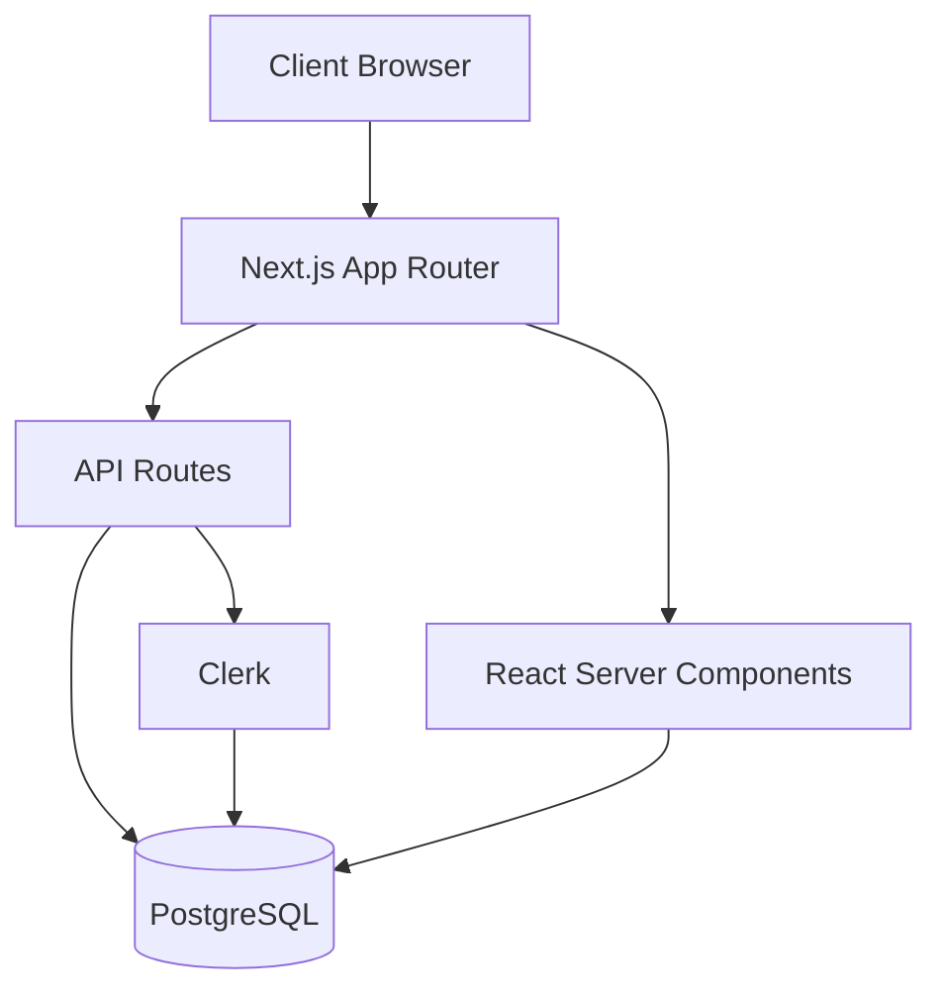
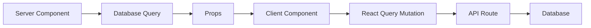
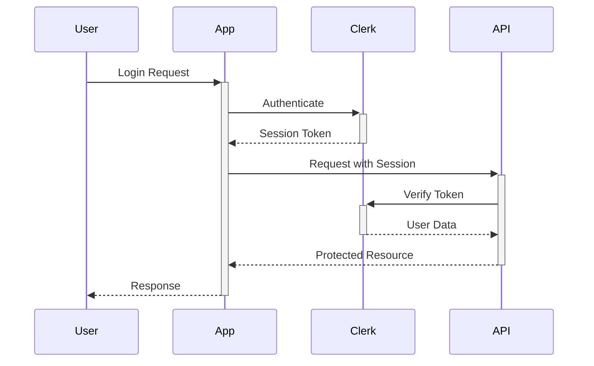
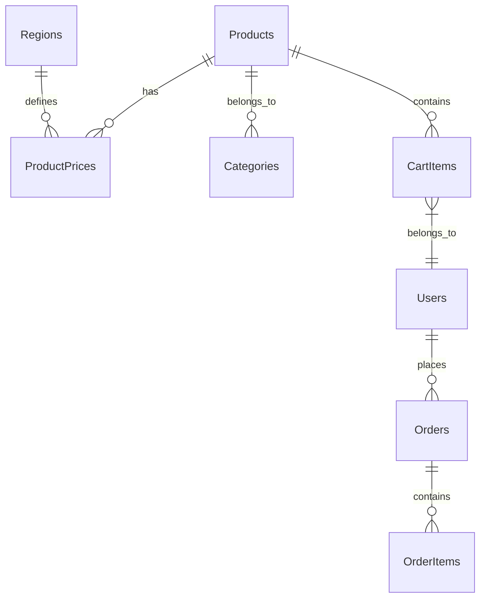
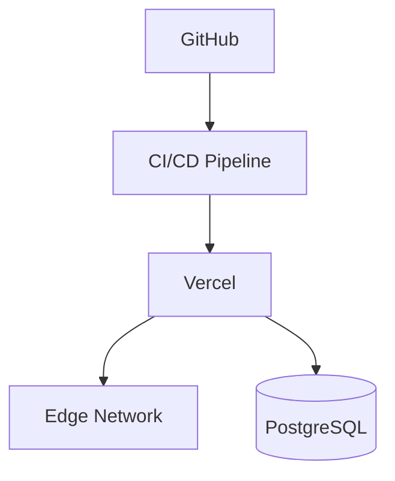

# Architecture Documentation

This document outlines the architectural design of the Ice Cream Land project.

## System Overview

Ice Cream Land is built as a modern web application using Next.js 14 with the App Router, following a full-stack architecture that emphasizes type safety, performance, and maintainability.



## Tech Stack

### Frontend

- **Framework**: Next.js 14 with App Router
- **Language**: TypeScript
- **Styling**: Tailwind CSS + shadcn/ui
- **State Management**:
  - Server State: React Query
  - Form State: React Hook Form
  - UI State: React Context

### Backend

- **Runtime**: Node.js
- **API**: Next.js API Routes
- **Authentication**: Clerk
- **Database Access**: Drizzle ORM

### Database

- **RDBMS**: PostgreSQL
- **Schema Management**: Drizzle ORM
- **Migrations**: Drizzle Kit

## Project Structure

```
ice-cream-land/
├── app/                    # Next.js App Router pages
│   ├── api/               # API routes
│   ├── (auth)/           # Authentication routes
│   ├── (shop)/           # Shop pages
│   └── layout.tsx         # Root layout
├── components/            # React components
│   ├── ui/               # Reusable UI components
│   └── [feature]/        # Feature-specific components
├── db/                    # Database configuration
│   ├── schema/           # Drizzle schema definitions
│   └── migrations/       # Database migrations
├── hooks/                # Custom React hooks
├── lib/                  # Utility functions
├── providers/            # React context providers
└── types/                # TypeScript type definitions
```

## Key Design Patterns

### 1. Server Components First

- Maximize use of React Server Components
- Client components only when necessary
- Streaming and Suspense for loading states

```typescript
// app/(shop)/products/page.tsx
export default async function ProductsPage() {
  const products = await getProducts();

  return (
    <Suspense fallback={<ProductsSkeleton />}>
      <ProductGrid products={products} />
    </Suspense>
  );
}
```

### 2. Data Flow



### 3. Component Architecture

We follow a hierarchical component structure:

1. **Page Components**

   - Handle data fetching
   - Define layout
   - Error boundaries

2. **Feature Components**

   - Business logic
   - State management
   - API interactions

3. **UI Components**
   - Reusable
   - Stateless
   - Style variations

```typescript
// Example of component hierarchy
<ProductPage>
  <ProductGrid>
    <ProductCard>
      <AddItemToCart />
    </ProductCard>
  </ProductGrid>
</ProductPage>
```

## Authentication Flow



### Authentication Features with Clerk

1. **User Management**

   - Social login providers
   - Email/password authentication
   - Multi-factor authentication
   - User profile management

2. **Session Handling**

   ```typescript
   // Example of protected API route
   import { auth } from '@clerk/nextjs';

   export async function GET() {
     const { userId } = auth();

     if (!userId) {
       return new Response('Unauthorized', { status: 401 });
     }

     // Handle authenticated request
   }
   ```

3. **Client-Side Protection**

   ```typescript
   // Example of protected page
   import { SignedIn, SignedOut, RedirectToSignIn } from "@clerk/nextjs";

   export default function ProtectedPage() {
     return (
       <>
         <SignedIn>
           <ProtectedContent />
         </SignedIn>
         <SignedOut>
           <RedirectToSignIn />
         </SignedOut>
       </>
     );
   }
   ```

4. **Role-Based Access**

   ```typescript
   // Example of role-based protection
   import { clerkClient } from '@clerk/nextjs';

   export async function hasRole(userId: string, role: string) {
     const user = await clerkClient.users.getUser(userId);
     return user.publicMetadata.role === role;
   }
   ```

### Database Integration

With Clerk handling user authentication, our database schema focuses on business data rather than user authentication:

1. **User References**

   ```sql
   CREATE TABLE user_preferences (
     clerk_user_id VARCHAR PRIMARY KEY,
     theme VARCHAR,
     notifications_enabled BOOLEAN,
     created_at TIMESTAMP DEFAULT NOW()
   );
   ```

2. **Order Management**
   ```sql
   CREATE TABLE orders (
     id UUID PRIMARY KEY,
     clerk_user_id VARCHAR NOT NULL,
     total DECIMAL NOT NULL,
     status VARCHAR NOT NULL,
     created_at TIMESTAMP DEFAULT NOW()
   );
   ```

### Security Best Practices

1. **Token Management**

   - Secure session token handling
   - Automatic token rotation
   - Cross-site request forgery protection

2. **Access Control**

   - Fine-grained permissions
   - Organization management
   - Role-based access control

3. **Security Features**
   - Passwordless authentication
   - Device management
   - Activity logging

## Database Architecture

### Overview

Ice Cream Land uses Neon PostgreSQL as its primary database, chosen for:

- Serverless architecture
- Automatic scaling
- Built-in connection pooling
- Point-in-time recovery
- Branch creation for development

### Schema Design



### Key Tables

1. **Products**

   - Core product information
   - Multi-language support
   - Image references
   - Nutritional info

2. **Regions**

   - Geographic regions (UZB, USA)
   - Currency settings
   - Localization preferences
   - Timezone data

3. **ProductPrices**

   - Region-specific pricing
   - Currency information
   - Promotional pricing
   - Historical price tracking

4. **Orders**
   - Order tracking
   - Payment status
   - Shipping details
   - Customer references

### Database Access Layer

1. **Drizzle ORM Integration**

   - Type-safe queries
   - Migration management
   - Relationship handling
   - Query building

2. **Connection Management**

   ```typescript
   // Example connection setup
   import { drizzle } from 'drizzle-orm/neon-serverless';
   import { Pool } from '@neondatabase/serverless';

   const pool = new Pool({ connectionString: process.env.DATABASE_URL });
   export const db = drizzle(pool);
   ```

3. **Query Patterns**
   - Use prepared statements
   - Implement connection pooling
   - Handle transactions properly
   - Optimize for N+1 queries

### Performance Considerations

1. **Indexing Strategy**

   - Primary keys
   - Foreign key indexes
   - Composite indexes for common queries
   - Full-text search indexes

2. **Query Optimization**

   - Efficient joins
   - Proper pagination
   - Caching strategy
   - Query monitoring

3. **Data Distribution**
   - Regional data partitioning
   - Archive strategies
   - Backup procedures
   - Data retention policies

## API Design

We follow REST principles with resource-based URLs:

```
/api/products       # Product management
/api/cart          # Cart operations
/api/orders        # Order processing
/api/analytics     # Analytics data
```

## Error Handling

1. **Client-Side**

   - React Error Boundaries
   - Form validation
   - API error handling

2. **Server-Side**
   - Request validation
   - Database error handling
   - Custom error responses

```typescript
// Example error handling
try {
  const result = await db.query();
  return NextResponse.json(result);
} catch (error) {
  return NextResponse.json({ error: 'Database error' }, { status: 500 });
}
```

## Performance Optimization

1. **Server-Side**

   - Database indexing
   - Query optimization
   - Response caching

2. **Client-Side**
   - Code splitting
   - Image optimization
   - Bundle size optimization

## Security Measures

1. **Authentication**

   - Clerk integration
   - Session management
   - Role-based access

2. **Data Protection**

   - Input validation
   - SQL injection prevention
   - XSS protection

3. **API Security**
   - Rate limiting
   - CORS configuration
   - Request validation

## Deployment Architecture



## Monitoring and Logging

1. **Application Monitoring**

   - Error tracking
   - Performance metrics
   - User analytics

2. **Infrastructure Monitoring**
   - Server health
   - Database performance
   - API response times

## Future Considerations

1. **Scalability**

   - Horizontal scaling
   - Cache implementation
   - Load balancing

2. **Features**

   - Payment processing
   - Order management
   - Admin dashboard

3. **Technical Debt**
   - Code refactoring
   - Test coverage
   - Documentation updates
