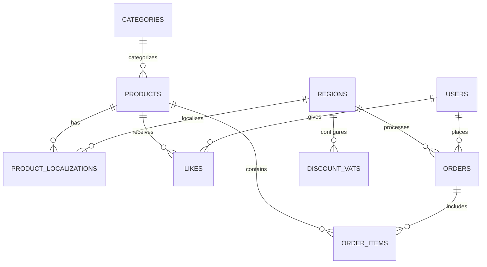

# Database Documentation

## Overview

Ice Cream Land uses PostgreSQL with Drizzle ORM for database management. The database is structured to support multi-regional e-commerce functionality with features like product localization, dynamic pricing, and order management.

## Schema Design

### Core Tables

#### Products

```sql
CREATE TABLE products (
  product_id SERIAL PRIMARY KEY,
  name VARCHAR NOT NULL,
  price NUMERIC(10,2) NOT NULL,
  currency VARCHAR NOT NULL DEFAULT 'USD',
  rating NUMERIC(3,1) NOT NULL,
  image_url VARCHAR NOT NULL,
  description TEXT,
  category_id SERIAL REFERENCES categories(category_id),
  is_hot BOOLEAN DEFAULT false,
  created_at TIMESTAMP NOT NULL DEFAULT NOW(),
  updated_at TIMESTAMP NOT NULL DEFAULT NOW()
);
```

#### Categories

```sql
CREATE TABLE categories (
  category_id SERIAL PRIMARY KEY,
  name VARCHAR UNIQUE NOT NULL,
  created_at TIMESTAMP NOT NULL DEFAULT NOW(),
  updated_at TIMESTAMP NOT NULL DEFAULT NOW()
);
```

#### Users

```sql
CREATE TABLE users (
  user_id VARCHAR PRIMARY KEY,
  username VARCHAR,
  first_name VARCHAR,
  last_name VARCHAR,
  created_at TIMESTAMP NOT NULL DEFAULT NOW(),
  updated_at TIMESTAMP NOT NULL DEFAULT NOW()
);
```

### Regional Support

#### Regions

```sql
CREATE TABLE regions (
  region_id CHAR(3) PRIMARY KEY,
  name VARCHAR NOT NULL,
  is_default BOOLEAN DEFAULT false,
  flag_url VARCHAR NOT NULL,
  currency CHAR(3) NOT NULL,
  created_at TIMESTAMP NOT NULL DEFAULT NOW(),
  updated_at TIMESTAMP NOT NULL DEFAULT NOW()
);
```

#### Product Localizations

```sql
CREATE TABLE product_localizations (
  product_localization_id SERIAL PRIMARY KEY,
  product_id INTEGER REFERENCES products(product_id) NOT NULL,
  region_id CHAR(3) REFERENCES regions(region_id) NOT NULL,
  localized_name VARCHAR,
  localized_description TEXT,
  created_at TIMESTAMP NOT NULL DEFAULT NOW(),
  updated_at TIMESTAMP NOT NULL DEFAULT NOW()
);
```

### Order Management

#### Orders

```sql
CREATE TABLE orders (
  order_id SERIAL PRIMARY KEY,
  user_id VARCHAR REFERENCES users(user_id) NOT NULL,
  region_id CHAR(3) REFERENCES regions(region_id) NOT NULL,
  total_amount NUMERIC(10,2) NOT NULL,
  currency CHAR(3) NOT NULL,
  discount_percentage NUMERIC(5,2) NOT NULL,
  tax_percentage NUMERIC(5,2) NOT NULL,
  discount_amount NUMERIC(10,2) NOT NULL,
  discounted_amount NUMERIC(10,2) NOT NULL,
  tax_amount NUMERIC(10,2) NOT NULL,
  status CHAR(20) DEFAULT 'pending',
  created_at TIMESTAMP NOT NULL DEFAULT NOW(),
  updated_at TIMESTAMP NOT NULL DEFAULT NOW()
);
```

#### Order Items

```sql
CREATE TABLE order_items (
  order_item_id SERIAL PRIMARY KEY,
  order_id INTEGER REFERENCES orders(order_id) NOT NULL,
  product_id INTEGER REFERENCES products(product_id) NOT NULL,
  quantity INTEGER NOT NULL,
  price NUMERIC(10,2) NOT NULL,
  currency CHAR(3) NOT NULL,
  created_at TIMESTAMP NOT NULL DEFAULT NOW(),
  updated_at TIMESTAMP NOT NULL DEFAULT NOW()
);
```

### Pricing and Discounts

#### Discount VATs

```sql
CREATE TABLE discount_vats (
  discount_vat_id SERIAL PRIMARY KEY,
  region_id CHAR(3) REFERENCES regions(region_id) NOT NULL,
  order_cost NUMERIC(10,2),
  discount_percentage NUMERIC(5,2),
  vat_percentage NUMERIC(5,2),
  created_at TIMESTAMP NOT NULL DEFAULT NOW(),
  updated_at TIMESTAMP NOT NULL DEFAULT NOW()
);
```

### User Interactions

#### Likes

```sql
CREATE TABLE likes (
  user_id VARCHAR REFERENCES users(user_id) NOT NULL,
  product_id INTEGER REFERENCES products(product_id) NOT NULL,
  PRIMARY KEY (user_id, product_id)
);
```

## Relationships



## Data Types

- **Numeric Values**

  - Prices: NUMERIC(10,2) for monetary values
  - Percentages: NUMERIC(5,2) for discount and tax rates
  - Ratings: NUMERIC(3,1) for product ratings

- **Text Fields**

  - Short Text: VARCHAR for names, usernames
  - Long Text: TEXT for descriptions
  - Fixed Length: CHAR(3) for currency and region codes

- **Timestamps**
  - All tables include created_at and updated_at
  - Default to NOW() on creation

## Indexing Strategy

1. **Primary Keys**

   - SERIAL for auto-incrementing IDs
   - Natural keys for regions (region_id)
   - Composite keys for junction tables

2. **Foreign Keys**

   - All relationships are properly indexed
   - Cascade rules for referential integrity

3. **Performance Indexes**
   - Product search by category
   - Order lookup by status
   - Regional price lookups

## Data Migration

Use Drizzle Kit for migrations:

```bash
# Generate migration
pnpm drizzle-kit generate:pg

# Push migration
pnpm db:push
```

## Sample Data

The project includes seed data for:

- Products with various categories
- Regional settings and currencies
- Discount and VAT configurations
- Sample users and orders

## Best Practices

1. **Data Integrity**

   - Use foreign key constraints
   - Implement soft deletes where appropriate
   - Maintain audit trails

2. **Performance**

   - Use appropriate indexes
   - Optimize query patterns
   - Regular maintenance

3. **Security**
   - Role-based access control
   - Data encryption
   - Input validation

## Common Queries

### Product Listing with Localization

```sql
SELECT
  p.*,
  pl.localized_name,
  pl.localized_description
FROM products p
LEFT JOIN product_localizations pl
  ON p.product_id = pl.product_id
  AND pl.region_id = $1;
```

### Order Summary

```sql
SELECT
  o.*,
  json_agg(oi.*) as items
FROM orders o
JOIN order_items oi
  ON o.order_id = oi.order_id
WHERE o.user_id = $1
GROUP BY o.order_id;
```

### Regional Pricing

```sql
SELECT
  p.*,
  dv.discount_percentage,
  dv.vat_percentage
FROM products p
JOIN discount_vats dv
  ON dv.region_id = $1
WHERE p.product_id = $2;
```
