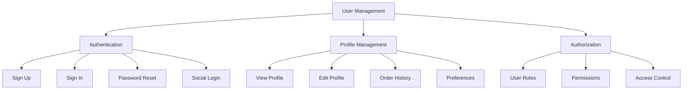
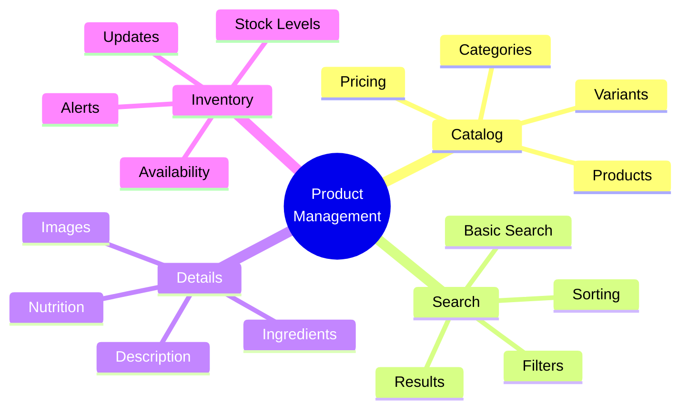
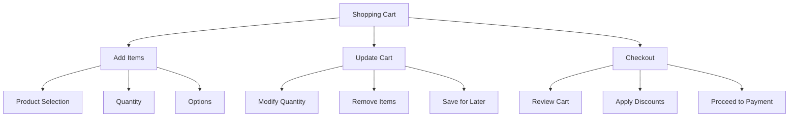
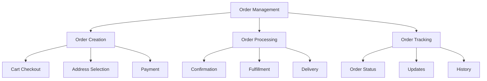
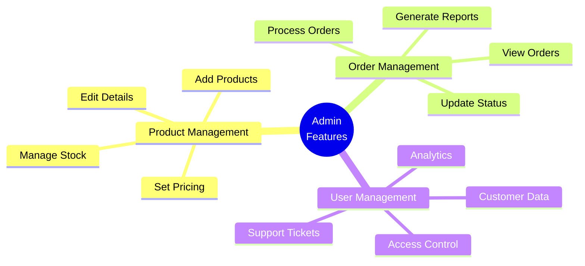

# Ice Cream Land - Functional Requirements

## Overview

This document outlines the functional requirements for the Ice Cream Land e-commerce platform. It details the specific features, capabilities, and interactions that the system must provide to meet user needs and business objectives.

## User Management

### 1. Authentication Requirements

1. **User Registration**

   - Email registration
   - Social media login integration
   - Username/password creation
   - Email verification
   - Terms acceptance

2. **Login System**

   - Email/password login
   - Social media authentication
   - Remember me functionality
   - Session management
   - Secure token handling

3. **Password Management**
   - Password reset
   - Password change
   - Password strength requirements
   - Security questions
   - Reset link expiration

### 2. Profile Management

1. **User Profile**

   - Personal information
   - Contact details
   - Delivery addresses
   - Payment methods
   - Preferences

2. **Order Management**
   - Order history
   - Order tracking
   - Order details
   - Reorder functionality
   - Order cancellation

## Product Management

### 1. Product Catalog

1. **Product Listing**

   - Category organization
   - Product grid/list view
   - Sorting options
   - Filtering capabilities
   - Pagination

2. **Product Details**

   - Product images
   - Detailed description
   - Pricing information
   - Nutritional information
   - Ingredients list

3. **Product Search**
   - Basic search
   - Advanced filters
   - Category navigation
   - Search suggestions
   - Recent searches

### 2. Inventory Management

1. **Stock Control**

   - Real-time inventory
   - Low stock alerts
   - Out of stock handling
   - Stock updates
   - Availability status

2. **Product Variants**
   - Size options
   - Flavor variations
   - Packaging options
   - Special editions
   - Seasonal items

## Shopping Cart

### 1. Cart Functions

1. **Cart Management**

   - Add to cart
   - Update quantities
   - Remove items
   - Save for later
   - Clear cart

2. **Cart Features**
   - Real-time total calculation
   - Tax calculation
   - Shipping cost estimation
   - Discount application
   - Cart persistence

### 2. Checkout Process

1. **Checkout Flow**

   - Cart review
   - Address selection
   - Shipping method
   - Payment selection
   - Order confirmation

2. **Payment Processing**
   - Multiple payment methods
   - Secure transactions
   - Payment validation
   - Receipt generation
   - Order confirmation

## Order Management

### 1. Order Processing

1. **Order Creation**

   - Order placement
   - Order number generation
   - Payment processing
   - Confirmation email
   - Order summary

2. **Order Fulfillment**
   - Status updates
   - Delivery tracking
   - Delivery notifications
   - Delivery confirmation
   - Customer feedback

### 2. Order History

1. **Order Tracking**

   - Order status
   - Delivery status
   - Order details
   - Tracking information
   - Delivery estimates

2. **Order Management**
   - View orders
   - Cancel orders
   - Modify orders
   - Reorder functionality
   - Order notes

## Admin Features

### 1. Product Administration

1. **Product Management**

   - Add new products
   - Edit product details
   - Manage categories
   - Set pricing
   - Update inventory

2. **Content Management**
   - Product descriptions
   - Image management
   - Category organization
   - Featured products
   - Promotional content

### 2. Order Administration

1. **Order Management**

   - View all orders
   - Process orders
   - Update status
   - Cancel orders
   - Generate reports

2. **Customer Service**
   - View customer data
   - Handle support tickets
   - Process returns
   - Manage refunds
   - Customer communication

## Analytics and Reporting

### 1. Business Analytics

1. **Sales Analytics**

   - Revenue tracking
   - Sales reports
   - Product performance
   - Customer analytics
   - Trend analysis

2. **Inventory Analytics**
   - Stock levels
   - Product movement
   - Reorder points
   - Wastage tracking
   - Demand forecasting

### 2. Customer Analytics

1. **User Behavior**

   - Shopping patterns
   - Search trends
   - Cart abandonment
   - Product preferences
   - Purchase history

2. **Performance Metrics**
   - Site performance
   - Conversion rates
   - User engagement
   - Error tracking
   - Load times

## Security Requirements

### 1. Data Security

1. **User Data**

   - Encryption
   - Secure storage
   - Access control
   - Data backup
   - Privacy compliance

2. **Transaction Security**
   - Secure payments
   - PCI compliance
   - Fraud detection
   - Security logging
   - Error handling

### 2. System Security

1. **Access Control**

   - Role-based access
   - Authentication
   - Authorization
   - Session management
   - Activity logging

2. **Platform Security**
   - SSL/TLS
   - DDoS protection
   - Input validation
   - Error handling
   - Security updates

## Integration Requirements

### 1. External Systems

1. **Payment Gateway**

   - Payment processing
   - Refund handling
   - Transaction logging
   - Payment security
   - Error handling

2. **Delivery Integration**
   - Shipping calculation
   - Tracking integration
   - Delivery updates
   - Address validation
   - Service selection

### 2. Third-party Services

1. **Email Service**

   - Order confirmations
   - Status updates
   - Marketing emails
   - Password reset
   - Notifications

2. **Analytics Integration**
   - User tracking
   - Performance monitoring
   - Error tracking
   - Usage analytics
   - Reporting tools

## Conclusion

These functional requirements define the core capabilities needed for Ice Cream Land:

1. **Core Functions**

   - User management
   - Product catalog
   - Shopping cart
   - Order processing
   - Admin features

2. **Support Functions**

   - Analytics
   - Security
   - Integrations
   - Reporting
   - Monitoring

3. **User Experience**
   - Easy navigation
   - Efficient checkout
   - Order tracking
   - Account management
   - Customer support

These requirements will guide the development of a comprehensive e-commerce solution that meets both user needs and business objectives.
