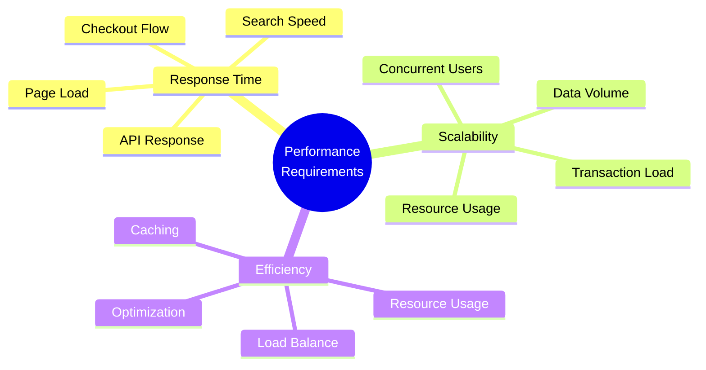
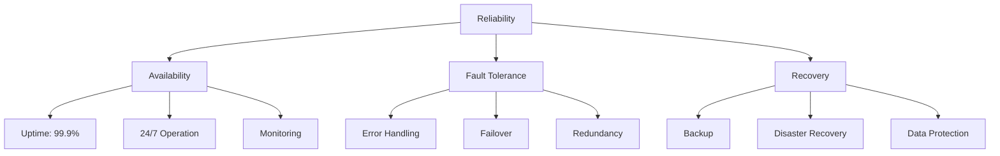
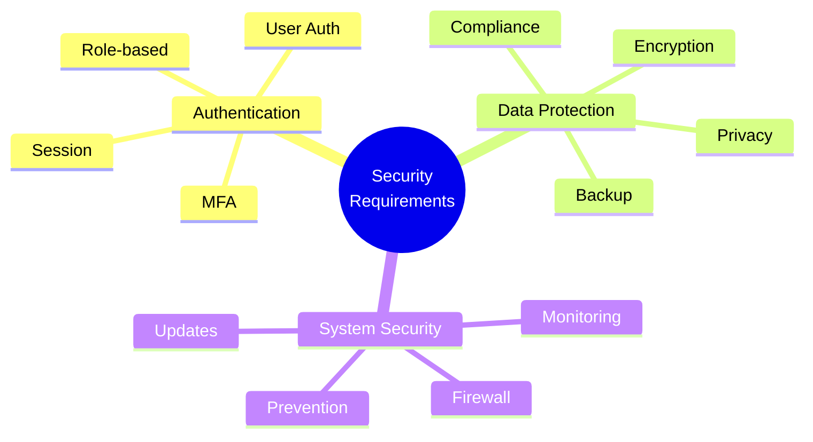
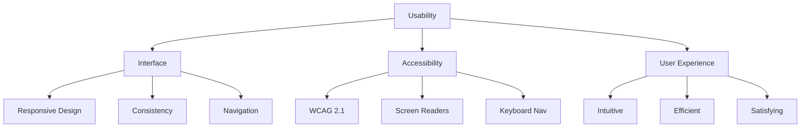
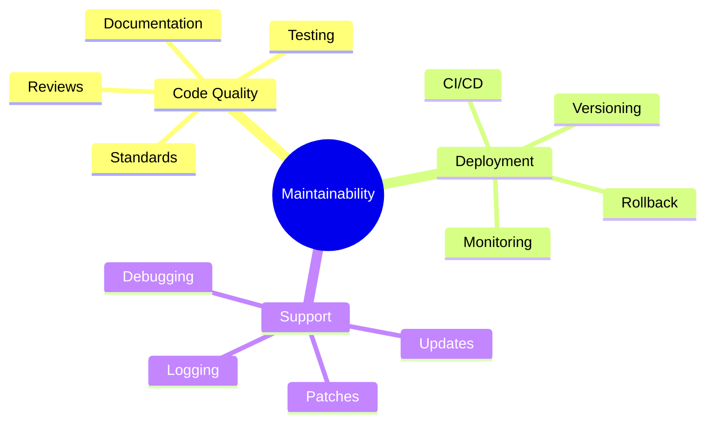

# Ice Cream Land - Non-Functional Requirements

## Overview

This document outlines the non-functional requirements for the Ice Cream Land e-commerce platform. These requirements specify criteria for evaluating the operation of the system, rather than specific behaviors.

## Performance Requirements

### 1. Response Time

1. **Page Performance**

   - Initial page load: < 2 seconds
   - Subsequent page loads: < 1 second
   - Time to Interactive (TTI): < 3 seconds
   - First Contentful Paint (FCP): < 1.5 seconds
   - Largest Contentful Paint (LCP): < 2.5 seconds

2. **API Performance**
   - API response time: < 200ms
   - Database queries: < 100ms
   - Search results: < 500ms
   - Cart updates: < 300ms
   - Payment processing: < 3 seconds

### 2. Scalability

1. **System Capacity**

   - Concurrent users: 10,000+
   - Daily transactions: 100,000+
   - Product catalog: 10,000+ items
   - Media storage: 1TB+
   - Database size: 500GB+

2. **Load Handling**
   - Peak load handling: 2x average
   - Auto-scaling capability
   - No performance degradation under load
   - Resource optimization
   - Dynamic content delivery

## Reliability Requirements

### 1. System Availability

1. **Uptime Requirements**

   - System availability: 99.9%
   - Planned maintenance: < 4 hours/month
   - Unplanned downtime: < 1 hour/month
   - Recovery Time Objective (RTO): < 1 hour
   - Recovery Point Objective (RPO): < 5 minutes

2. **Fault Tolerance**
   - Automatic failover
   - Load balancing
   - Data replication
   - Error recovery
   - System redundancy

### 2. Data Reliability

1. **Data Integrity**

   - Transaction consistency
   - Data validation
   - Error checking
   - Audit trails
   - Version control

2. **Backup Requirements**
   - Daily backups
   - Point-in-time recovery
   - Geo-redundancy
   - Backup verification
   - Retention policy

## Security Requirements

### 1. Authentication & Authorization

1. **User Security**

   - Strong password policy
   - Multi-factor authentication
   - Session management
   - Access control
   - Role-based permissions

2. **Data Security**
   - Data encryption at rest
   - Data encryption in transit
   - Secure key management
   - Personal data protection
   - Data anonymization

### 2. System Security

1. **Infrastructure Security**

   - Firewall protection
   - DDoS protection
   - Intrusion detection
   - Vulnerability scanning
   - Security updates

2. **Compliance**
   - GDPR compliance
   - PCI DSS compliance
   - Data privacy laws
   - Security standards
   - Audit requirements

## Usability Requirements

### 1. User Interface

1. **Design Requirements**

   - Responsive design
   - Consistent layout
   - Intuitive navigation
   - Visual hierarchy
   - Clear typography

2. **Accessibility**
   - WCAG 2.1 compliance
   - Screen reader support
   - Keyboard navigation
   - Color contrast
   - Alt text for images

### 2. User Experience

1. **Interaction Design**

   - Clear feedback
   - Error prevention
   - Easy recovery
   - Efficient workflows
   - Help documentation

2. **Mobile Experience**
   - Touch-friendly interface
   - Mobile optimization
   - Offline capabilities
   - Fast loading
   - Responsive images

## Maintainability Requirements

### 1. Code Quality

1. **Development Standards**

   - Coding standards
   - Documentation requirements
   - Testing coverage: > 80%
   - Code review process
   - Version control

2. **Deployment Process**
   - Automated deployment
   - Version control
   - Rollback capability
   - Environment parity
   - Configuration management

### 2. Monitoring

1. **System Monitoring**

   - Performance monitoring
   - Error tracking
   - Usage analytics
   - Resource monitoring
   - Alert system

2. **Maintenance**
   - Regular updates
   - Security patches
   - Bug fixes
   - Feature updates
   - Documentation updates

## Compatibility Requirements

### 1. Browser Support

1. **Desktop Browsers**

   - Chrome (latest 2 versions)
   - Firefox (latest 2 versions)
   - Safari (latest 2 versions)
   - Edge (latest 2 versions)
   - Opera (latest version)

2. **Mobile Browsers**
   - iOS Safari
   - Android Chrome
   - Samsung Internet
   - Mobile Firefox
   - Mobile Edge

### 2. Device Support

1. **Mobile Devices**

   - iOS devices (iOS 14+)
   - Android devices (Android 8+)
   - Tablets
   - Progressive Web App
   - Touch optimization

2. **Screen Sizes**
   - Desktop (1920x1080+)
   - Laptop (1366x768+)
   - Tablet (768x1024+)
   - Mobile (320x568+)
   - Responsive breakpoints

## Performance Metrics

### 1. Core Web Vitals

1. **Loading Performance**

   - LCP (Largest Contentful Paint): < 2.5s
   - FID (First Input Delay): < 100ms
   - CLS (Cumulative Layout Shift): < 0.1
   - TTFB (Time to First Byte): < 200ms
   - FCP (First Contentful Paint): < 1.5s

2. **User-centric Metrics**
   - Bounce rate: < 40%
   - Session duration: > 3 minutes
   - Pages per session: > 3
   - Cart abandonment: < 30%
   - Conversion rate: > 2%

## Infrastructure Requirements

### 1. Hosting Requirements

1. **Server Infrastructure**

   - Cloud-based hosting
   - Auto-scaling
   - Load balancing
   - CDN integration
   - Edge computing

2. **Network Requirements**
   - Bandwidth capacity
   - Network redundancy
   - DDoS protection
   - SSL/TLS encryption
   - API rate limiting

## Compliance Requirements

### 1. Legal Compliance

1. **Data Protection**

   - GDPR compliance
   - CCPA compliance
   - Data privacy
   - Cookie consent
   - Terms of service

2. **Industry Standards**
   - PCI DSS compliance
   - Accessibility standards
   - Security standards
   - Payment regulations
   - Data retention

## Documentation Requirements

### 1. Technical Documentation

1. **System Documentation**

   - Architecture documentation
   - API documentation
   - Code documentation
   - Deployment guides
   - Security protocols

2. **User Documentation**
   - User guides
   - Admin manuals
   - API guides
   - FAQs
   - Troubleshooting guides

## Conclusion

These non-functional requirements establish the quality attributes of Ice Cream Land:

1. **Performance Standards**

   - Response times
   - Scalability
   - Reliability
   - Availability

2. **Quality Attributes**

   - Security
   - Usability
   - Maintainability
   - Compatibility

3. **Compliance**
   - Legal requirements
   - Industry standards
   - Best practices
   - Documentation

These requirements ensure the system meets quality standards while providing an optimal user experience.
