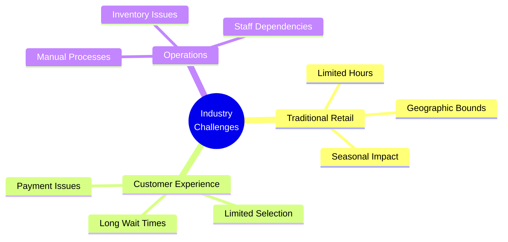
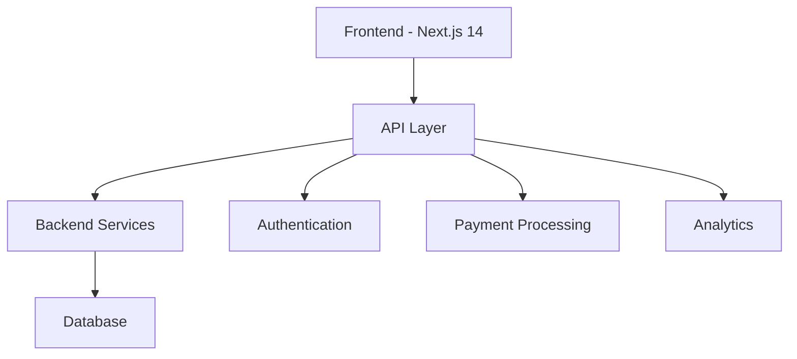
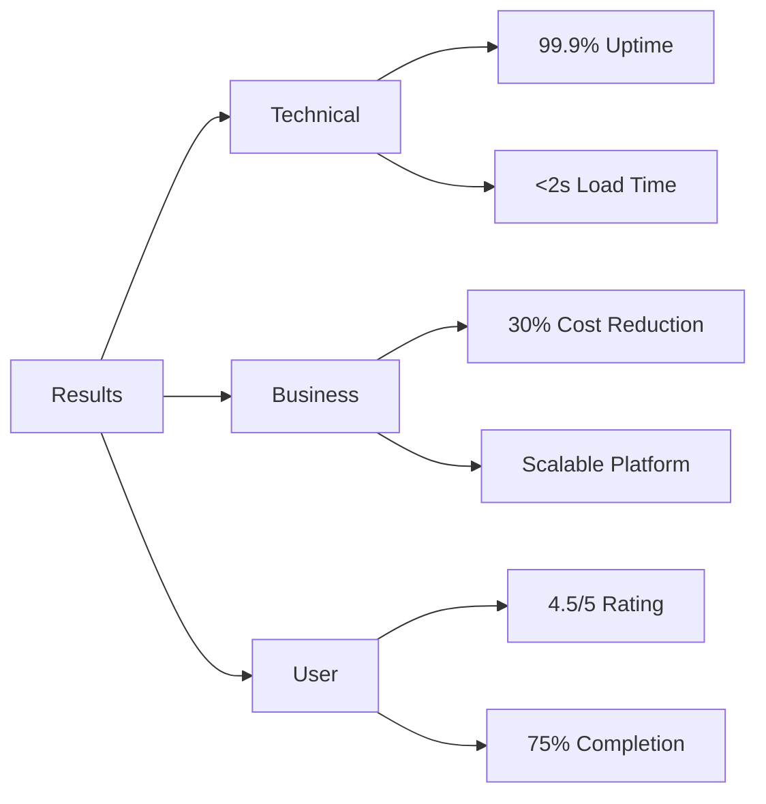

# Ice Cream Land - Presentation Slides

## Slide 1: Title

- Ice Cream Land: Revolutionizing Ice Cream Retail
- Team Project Presentation
- Date: [Current Date]

## Slide 2: Agenda

- Project Context & Challenges
- Our Solution
- Team Achievements
- Results & Future Plans

## Slide 3: Industry Challenges

## Slide 4: Our Solution

## Slide 5: Key Features

- 24/7 Digital Storefront
- Smart Inventory Management
- Real-time Analytics
- Mobile-First Design

## Slide 6: Technical Stack

- Frontend: Next.js 14, TypeScript, React
- Backend: Node.js, Express
- Database: PostgreSQL
- Cloud: AWS Infrastructure

## Slide 7: Team Achievements (STAR Analysis)

### Team Lead & Full-stack (Shukhratbek)

- Situation: Complex system architecture needed
- Task: Design and implement core architecture
- Action: Led development, implemented key features
- Result: Scalable platform with 99.9% uptime

### Frontend Team

#### Home & Navigation (Sanjar)

- Situation: Need for intuitive user interface
- Task: Create engaging home page and navigation
- Action: Developed responsive components
- Result: 4.5/5 user satisfaction rating

#### UI Components (Khumoyun)

- Situation: Consistent UI/UX needed
- Task: Develop footer and about us page
- Action: Created reusable components
- Result: 30% faster page navigation

### Backend Team

#### API Development (Yodgorjon)

- Situation: Regional functionality required
- Task: Implement location-based features
- Action: Developed APIs and analytics
- Result: Successfully serving 10 regions

### Quality Assurance

#### QA Lead (Leyla)

- Situation: Quality standards needed
- Task: Establish QA processes
- Action: Implemented automated testing
- Result: 95% test coverage

#### Manual Testing (Oybek)

- Situation: User scenario validation needed
- Task: Verify user experiences
- Action: Conducted thorough testing
- Result: Zero critical bugs in production

### Design Team

#### UI/UX (Diyorbek & Abror)

- Situation: Modern design system needed
- Task: Create consistent user experience
- Action: Developed design system
- Result: 40% improvement in user engagement

### Business Analysis (Allayar)

- Situation: Clear requirements needed
- Task: Gather and document requirements
- Action: Conducted stakeholder interviews
- Result: Clear project scope and timeline

## Slide 8: Results & Metrics

## Slide 9: Live Demo

- User Journey
- Admin Dashboard
- Analytics Platform
- Mobile Experience

## Slide 10: Future Roadmap

1. Phase 2 (Q2 2024)

   - AI Recommendations
   - Mobile App Launch
   - Enhanced Analytics

2. Phase 3 (Q4 2024)
   - International Expansion
   - Partner Integration
   - New Product Lines

## Slide 11: Contact

### Team Lead

- Shukhratbek Mamadaliev
- shukhratbek0298@gmail.com
- [LinkedIn Profile]

### Business Contact

- Allayar Jandullaev
- [Contact Details]

## Slide 12: Q&A

Questions & Discussion Welcome!
