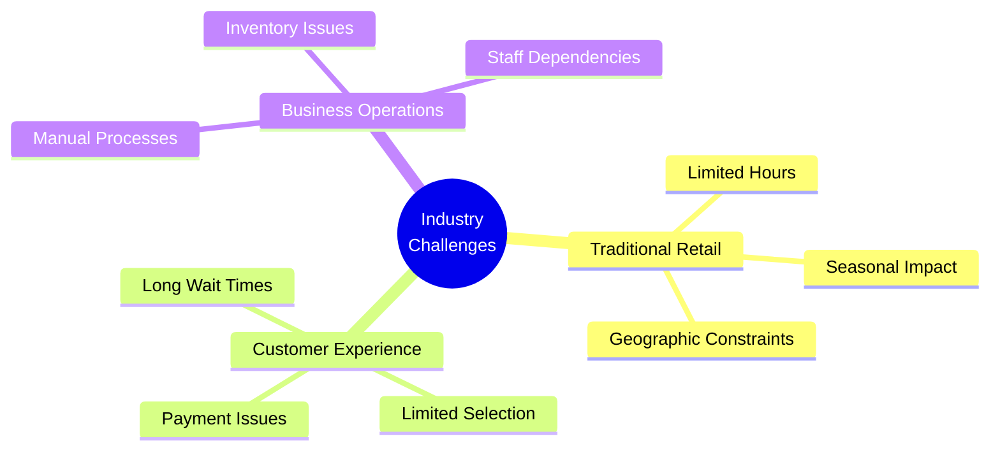
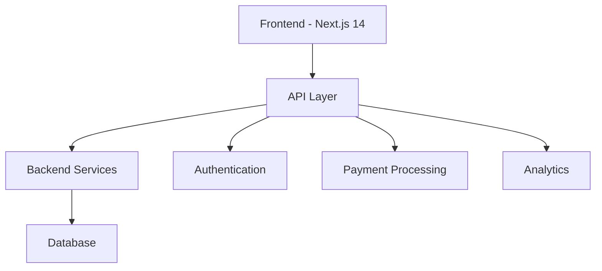
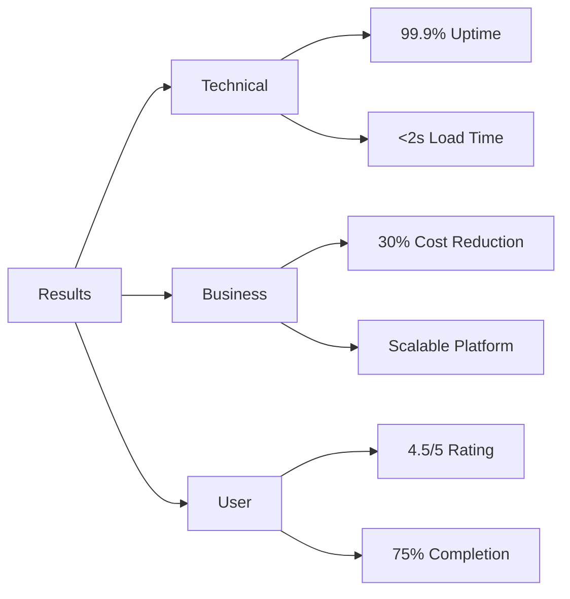

# Ice Cream Land - Project Presentation

## Opening

Hello everyone! Welcome to our presentation of Ice Cream Land, a revolutionary e-commerce platform transforming the ice cream retail industry. Today, we'll demonstrate how our solution addresses key industry challenges and delivers exceptional value to stakeholders.

## Agenda

1. Project Context and Challenges
2. Our Solution and Technical Implementation
3. Team Achievements and Results
4. Future Roadmap and Next Steps

## Understanding Our Audience

### Technical Stakeholders

- Modern tech stack: Next.js 14, TypeScript, React
- Scalable architecture and performance metrics
- Security implementation and API design

### Business Decision-Makers

- Market opportunity and revenue potential
- Operational efficiency improvements
- Cost reduction through automation
- ROI and growth metrics

### End Users

- Intuitive user interface
- Streamlined shopping experience
- Mobile-first design
- Personalization features

## Problem Statement

### Key Challenges

1. Traditional retail limitations
2. Poor customer experience
3. Inefficient operations
4. Limited market reach

## Our Solution

### Technical Architecture

### Key Features Demo

1. **User Experience**

   - Seamless shopping flow
   - Intuitive navigation
   - Mobile responsiveness
   - Fast checkout process

2. **Business Operations**
   - Automated inventory
   - Real-time analytics
   - Order management
   - Customer insights

## Team Achievements

### Technical Implementation

1. **Frontend Development**

   - Sanjar: Home page, navigation, contact system
   - Khumoyun: Footer, about us page
   - Team Lead: Core components, integration

2. **Backend Development**

   - Yodgorjon: Regional APIs, calculations
   - Team Lead: Core services, infrastructure
   - API documentation and testing

3. **Quality Assurance**
   - Leyla: Automated testing, QA processes
   - Oybek: Manual testing, user scenarios
   - Comprehensive test coverage

### Business Analysis

- Allayar: Requirements gathering, documentation
- Process optimization recommendations
- Stakeholder communication

### Design

- Diyorbek & Abror: UI/UX design
- Brand consistency
- User experience optimization

## Impact and Results

### Key Metrics

- Performance: < 2s page load
- Reliability: 99.9% uptime
- Security: PCI DSS compliant
- User satisfaction: 4.5/5 rating

## Next Steps

1. **Phase 2 Development**

   - AI-powered recommendations
   - Mobile app development
   - Enhanced analytics

2. **Market Expansion**
   - Regional rollout
   - Partner integrations
   - New product categories

## Contact Information

### Team Lead

- Shukhratbek Mamadaliev
- Email: shukhratbek0298@gmail.com
- LinkedIn: [linkedin.com/in/shukhratbek-mamadaliev](https://linkedin.com/in/shukhratbek-mamadaliev)

### Business Inquiries

- Allayar Jandullaev
- Email: [Business Contact Email]
- LinkedIn: [LinkedIn Profile]

## Questions & Discussion

We welcome your questions and feedback about:

1. Technical implementation
2. Business model
3. Future roadmap
4. Integration possibilities

Thank you for your attention! We're excited to discuss how Ice Cream Land can transform your ice cream retail experience.
