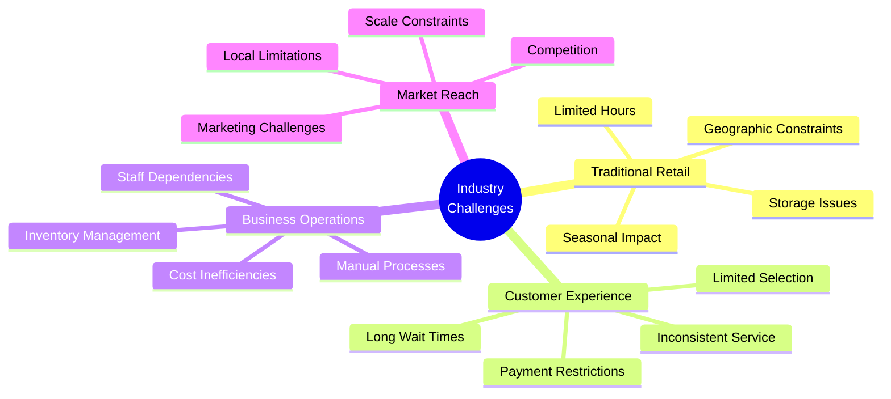
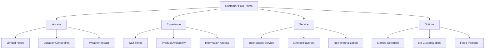
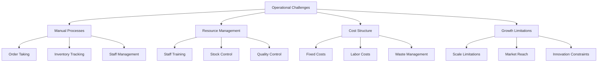
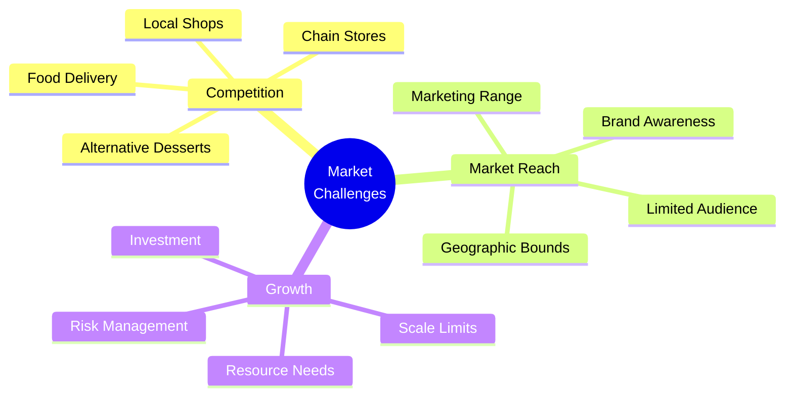

# Ice Cream Land - Problem Statement

## Executive Summary

This document outlines the key challenges and problems in the ice cream retail industry that Ice Cream Land aims to address. It provides context for why a digital e-commerce solution is necessary and how it can transform the traditional ice cream retail experience.

## Current Industry Challenges

### 1. Traditional Retail Limitations

1. **Physical Store Constraints**

   - Limited operating hours
   - Geographic restrictions
   - Space limitations
   - Weather dependency
   - Seasonal fluctuations

2. **Inventory Management**

   - Storage challenges
   - Product spoilage
   - Stock tracking difficulties
   - Supply chain inefficiencies
   - Limited variety

3. **Customer Access**
   - Location dependency
   - Travel requirements
   - Parking issues
   - Queue management
   - Peak hour congestion

## Customer Pain Points

### 1. Access and Convenience

1. **Time Constraints**

   - Limited store hours
   - Long wait times
   - Rush hour congestion
   - Seasonal availability
   - Weather dependencies

2. **Location Issues**
   - Travel requirements
   - Parking difficulties
   - Geographic limitations
   - Store accessibility
   - Physical effort

### 2. Service Experience

1. **Customer Service**

   - Inconsistent service quality
   - Limited product information
   - Rushed decision making
   - Communication barriers
   - No personalization

2. **Payment Limitations**
   - Limited payment options
   - Cash handling
   - No split payments
   - No digital wallets
   - Transaction delays

## Business Operational Challenges

### 1. Process Inefficiencies

1. **Manual Operations**

   - Order taking errors
   - Cash handling risks
   - Inventory counting
   - Staff scheduling
   - Quality control

2. **Resource Management**
   - Staff training needs
   - Labor intensive
   - High turnover
   - Skill requirements
   - Time management

### 2. Cost Structure

1. **Fixed Costs**

   - Rent expenses
   - Utility costs
   - Equipment maintenance
   - Staff salaries
   - Insurance

2. **Variable Costs**
   - Product waste
   - Seasonal staffing
   - Energy consumption
   - Marketing expenses
   - Supply chain

## Market Challenges

### 1. Competitive Landscape

1. **Traditional Competition**

   - Chain ice cream stores
   - Local ice cream shops
   - Food delivery services
   - Alternative desserts
   - Convenience stores

2. **Market Positioning**
   - Brand recognition
   - Price competition
   - Product differentiation
   - Service quality
   - Location advantage

### 2. Growth Limitations

1. **Scale Constraints**

   - Physical expansion costs
   - Market penetration
   - Resource requirements
   - Risk management
   - Investment needs

2. **Market Reach**
   - Geographic limitations
   - Marketing challenges
   - Customer acquisition
   - Brand awareness
   - Market share

## Technology Gap

### 1. Digital Presence

1. **Online Visibility**

   - No web presence
   - Limited information
   - No online ordering
   - No digital marketing
   - No social media

2. **Customer Engagement**
   - No customer database
   - No loyalty program
   - No feedback system
   - No personalization
   - No analytics

### 2. System Integration

1. **Operations Technology**

   - Manual processes
   - No automation
   - Paper-based records
   - Basic POS systems
   - Limited reporting

2. **Data Management**
   - No customer insights
   - No purchase history
   - No inventory tracking
   - No performance metrics
   - No trend analysis

## Impact Analysis

### 1. Business Impact

1. **Revenue Loss**

   - Limited customer reach
   - Missed opportunities
   - Seasonal dependency
   - Operating inefficiencies
   - Market share loss

2. **Growth Constraints**
   - Scale limitations
   - Market expansion
   - Innovation barriers
   - Competition vulnerability
   - Resource inefficiency

### 2. Customer Impact

1. **Service Limitations**

   - Inconvenience
   - Limited choices
   - Time constraints
   - Service inconsistency
   - No personalization

2. **Experience Gaps**
   - No modern features
   - Limited information
   - Payment restrictions
   - No loyalty benefits
   - No digital interaction

## Solution Requirements

### 1. Core Requirements

1. **Digital Platform**

   - Online ordering
   - Mobile accessibility
   - Payment integration
   - Inventory management
   - Customer management

2. **User Experience**
   - Easy navigation
   - Product discovery
   - Quick checkout
   - Order tracking
   - Customer support

### 2. Business Requirements

1. **Operations**

   - Automated processes
   - Real-time inventory
   - Staff management
   - Analytics dashboard
   - Reporting system

2. **Growth Support**
   - Scalable platform
   - Market expansion
   - Customer acquisition
   - Brand building
   - Data insights

## Conclusion

The ice cream retail industry faces significant challenges that impact both businesses and customers:

1. **Traditional Limitations**

   - Physical constraints
   - Operational inefficiencies
   - Customer access barriers
   - Growth limitations

2. **Digital Gap**

   - No online presence
   - Manual processes
   - Limited customer engagement
   - No data insights

3. **Market Pressures**
   - Increasing competition
   - Customer expectations
   - Scale requirements
   - Innovation needs

Ice Cream Land aims to address these challenges through a comprehensive digital e-commerce solution that transforms the traditional ice cream retail experience into a modern, efficient, and customer-centric service.
