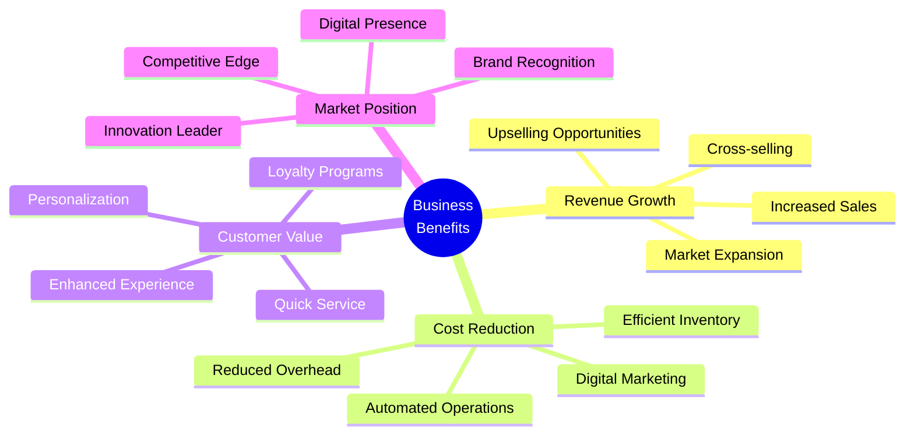
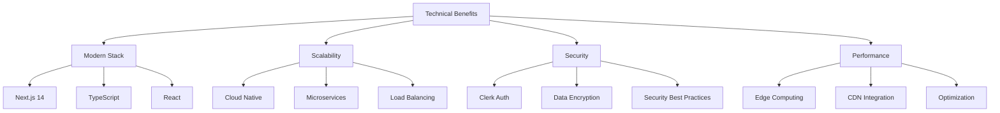
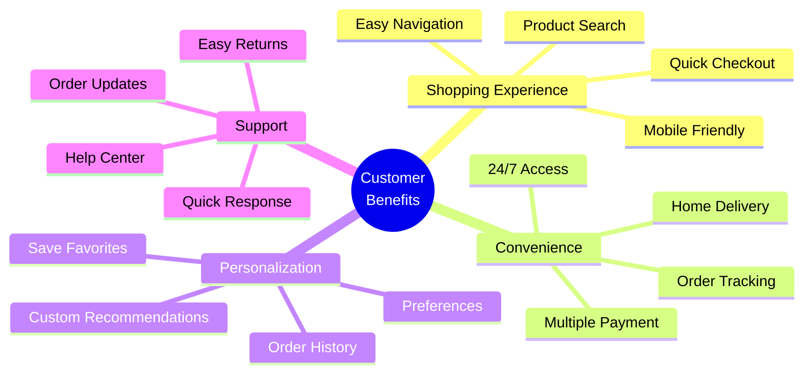
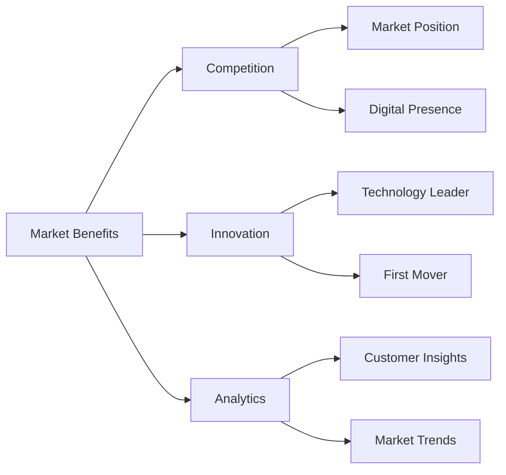

# Ice Cream Land - Project Benefits Analysis

## Executive Summary

Ice Cream Land is a modern e-commerce platform that brings significant value to multiple stakeholders. This document outlines the key benefits and advantages of the project across different dimensions.

## Business Benefits

### 1. Revenue Generation

1. **Sales Growth**

   - 24/7 online availability
   - Broader market reach
   - Multiple payment options
   - Seasonal promotions automation

2. **Market Expansion**

   - Geographic expansion without physical stores
   - New customer segments
   - Digital marketing capabilities
   - Social media integration

3. **Customer Monetization**
   - Loyalty program implementation
   - Cross-selling recommendations
   - Personalized promotions
   - Bundle offerings

### 2. Operational Efficiency

1. **Cost Reduction**

   - Automated order processing
   - Reduced manual intervention
   - Digital inventory management
   - Streamlined operations

2. **Resource Optimization**

   - Efficient staff allocation
   - Automated customer service
   - Digital marketing automation
   - Data-driven decision making

3. **Process Improvement**
   - Standardized operations
   - Quality control
   - Real-time monitoring
   - Performance analytics

## Technical Benefits

### 1. Architecture Benefits

1. **Modern Technology Stack**

   - Next.js 14 for optimal performance
   - TypeScript for type safety
   - React for dynamic UI
   - Tailwind CSS for styling
   - Clerk for authentication

2. **Scalability**

   - Cloud-native architecture
   - Horizontal scaling capability
   - Microservices readiness
   - Load balancing support

3. **Maintainability**
   - Clean code architecture
   - Modular design
   - Comprehensive documentation
   - Version control

### 2. Performance Benefits

1. **Speed Optimization**

   - Server-side rendering
   - Edge computing
   - CDN integration
   - Code splitting

2. **Resource Efficiency**

   - Optimized asset delivery
   - Efficient caching
   - Lazy loading
   - Bundle optimization

3. **User Experience**
   - Fast page loads
   - Smooth interactions
   - Responsive design
   - Offline capabilities

## Customer Benefits

### 1. User Experience

1. **Accessibility**

   - 24/7 availability
   - Mobile-friendly design
   - Multi-device support
   - Intuitive navigation

2. **Convenience**

   - Easy product discovery
   - Quick checkout process
   - Multiple payment options
   - Order tracking

3. **Personalization**
   - Custom recommendations
   - Saved preferences
   - Order history
   - Wishlists

### 2. Customer Service

1. **Support Features**

   - Quick response system
   - Order status updates
   - Easy returns process
   - Help documentation

2. **Communication**
   - Order confirmations
   - Delivery updates
   - Promotional notifications
   - Customer feedback

## Market Benefits

### 1. Competitive Advantage

1. **Market Position**

   - Digital presence
   - Brand recognition
   - Customer loyalty
   - Market share

2. **Innovation**
   - Technology leadership
   - First-mover advantage
   - Industry standards
   - Market trends

### 2. Market Intelligence

1. **Data Analytics**

   - Customer insights
   - Purchase patterns
   - Market trends
   - Competitor analysis

2. **Decision Support**
   - Data-driven decisions
   - Market forecasting
   - Inventory optimization
   - Pricing strategy

## Educational Benefits

### 1. Team Development

1. **Technical Skills**

   - Modern technology exposure
   - Best practices implementation
   - Problem-solving experience
   - Code quality standards

2. **Project Management**
   - Agile methodology
   - Team collaboration
   - Documentation practices
   - Version control

### 2. Knowledge Sharing

1. **Documentation**

   - Technical documentation
   - Code comments
   - Process workflows
   - Best practices

2. **Learning Opportunities**
   - New technologies
   - Industry standards
   - Problem-solving
   - Team collaboration

## Future Benefits

### 1. Scalability

1. **Business Growth**

   - Easy market expansion
   - New feature addition
   - Performance scaling
   - User base growth

2. **Technology Evolution**
   - Framework updates
   - New features
   - Security improvements
   - Performance optimization

### 2. Innovation Opportunities

1. **Feature Enhancement**

   - AI integration
   - Analytics expansion
   - Mobile apps
   - Social integration

2. **Market Expansion**
   - New markets
   - Product lines
   - Service offerings
   - Customer segments

## Conclusion

The Ice Cream Land project delivers comprehensive benefits across multiple dimensions:

1. **Business Value**

   - Revenue growth
   - Operational efficiency
   - Cost reduction
   - Market expansion

2. **Technical Excellence**

   - Modern architecture
   - Scalable platform
   - Performance optimization
   - Security measures

3. **Customer Satisfaction**

   - Enhanced experience
   - Convenience
   - Personalization
   - Quality service

4. **Future Readiness**
   - Scalability
   - Innovation potential
   - Market adaptability
   - Growth opportunities

These benefits position Ice Cream Land for sustainable growth and success in the digital marketplace.
