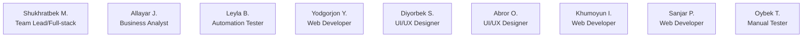
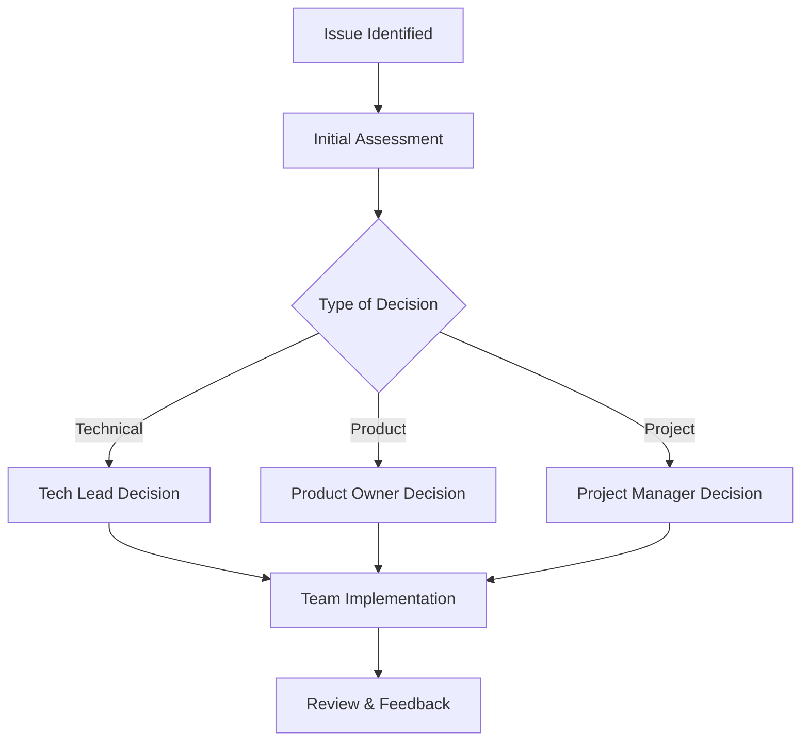

# Ice Cream Land - RACI Matrix

## Introduction

This RACI Matrix defines the roles and responsibilities for the Ice Cream Land e-commerce project. The matrix helps clarify who is:

- **R** (Responsible): Person who performs the task
- **A** (Accountable): Person ultimately answerable for the task
- **C** (Consulted): Person whose input is sought
- **I** (Informed): Person kept up-to-date on progress

## Project Roles

## RACI Matrix

### 1. Project Planning & Management

| Activity                | Team Lead (Shukhratbek) | Business Analyst (Allayar) | Web Developers (Yodgorjon, Khumoyun, Sanjar) | UI/UX Designers (Diyorbek, Abror) | QA Team (Leyla, Oybek) |
| ----------------------- | -------------------------- | ----------------------------- | ----------------------------------------------- | ------------------------------------ | ------------------------- |
| Project Vision          | A/R                        | R                             | I                                               | C                                    | I                         |
| Requirements Definition | A                          | R                             | C                                               | C                                    | C                         |
| Technical Architecture  | A/R                        | C                             | C                                               | I                                    | I                         |
| Sprint Planning         | A/R                        | R                             | C                                               | C                                    | C                         |
| Risk Management         | A/R                        | R                             | C                                               | I                                    | C                         |

### 2. Design & Development

| Activity              | Team Lead (Shukhratbek) | Business Analyst (Allayar) | Web Developers (Yodgorjon, Khumoyun, Sanjar) | UI/UX Designers (Diyorbek, Abror) | QA Team (Leyla, Oybek) |
| --------------------- | -------------------------- | ----------------------------- | ----------------------------------------------- | ------------------------------------ | ------------------------- |
| UI/UX Design          | A                          | C                             | C                                               | R                                    | C                         |
| Frontend Architecture | A/R                        | I                             | R                                               | C                                    | C                         |
| Backend Architecture  | A/R                        | I                             | C                                               | I                                    | C                         |
| Database Design       | A/R                        | C                             | C                                               | I                                    | I                         |
| API Development       | A/R                        | C                             | R                                               | I                                    | C                         |

### 3. Implementation

| Activity                | Team Lead (Shukhratbek) | Business Analyst (Allayar) | Web Developers (Yodgorjon, Khumoyun, Sanjar) | UI/UX Designers (Diyorbek, Abror) | QA Team (Leyla, Oybek) |
| ----------------------- | -------------------------- | ----------------------------- | ----------------------------------------------- | ------------------------------------ | ------------------------- |
| Frontend Components     | A                          | I                             | R                                               | C                                    | C                         |
| Backend Services        | A/R                        | I                             | R                                               | I                                    | C                         |
| Database Implementation | A/R                        | I                             | C                                               | I                                    | C                         |
| Authentication System   | A/R                        | I                             | R                                               | I                                    | C                         |
| CI/CD Pipeline          | A/R                        | I                             | C                                               | I                                    | C                         |

### 4. Quality Assurance

| Activity            | Team Lead (Shukhratbek) | Business Analyst (Allayar) | Web Developers (Yodgorjon, Khumoyun, Sanjar) | UI/UX Designers (Diyorbek, Abror) | QA Team (Leyla, Oybek) |
| ------------------- | -------------------------- | ----------------------------- | ----------------------------------------------- | ------------------------------------ | ------------------------- |
| Test Planning       | A                          | C                             | C                                               | I                                    | R                         |
| Unit Testing        | A                          | I                             | R                                               | I                                    | C                         |
| Integration Testing | A                          | I                             | C                                               | I                                    | R                         |
| Performance Testing | A                          | I                             | C                                               | I                                    | R                         |
| Security Testing    | A/R                        | I                             | C                                               | I                                    | R                         |

### 5. Deployment & Operations

| Activity                 | Team Lead (Shukhratbek) | Business Analyst (Allayar) | Web Developers (Yodgorjon, Khumoyun, Sanjar) | UI/UX Designers (Diyorbek, Abror) | QA Team (Leyla, Oybek) |
| ------------------------ | -------------------------- | ----------------------------- | ----------------------------------------------- | ------------------------------------ | ------------------------- |
| Environment Setup        | A/R                        | I                             | C                                               | I                                    | C                         |
| Deployment Process       | A/R                        | I                             | C                                               | I                                    | C                         |
| Monitoring Setup         | A/R                        | I                             | C                                               | I                                    | C                         |
| Performance Optimization | A/R                        | I                             | R                                               | C                                    | C                         |
| Security Monitoring      | A/R                        | I                             | C                                               | I                                    | C                         |

### 6. Documentation

| Activity                | Team Lead (Shukhratbek) | Business Analyst (Allayar) | Web Developers (Yodgorjon, Khumoyun, Sanjar) | UI/UX Designers (Diyorbek, Abror) | QA Team (Leyla, Oybek) |
| ----------------------- | -------------------------- | ----------------------------- | ----------------------------------------------- | ------------------------------------ | ------------------------- |
| Technical Documentation | A/R                        | C                             | R                                               | I                                    | C                         |
| API Documentation       | A/R                        | C                             | R                                               | I                                    | C                         |
| User Documentation      | A                          | R                             | C                                               | C                                    | C                         |
| Test Documentation      | A                          | C                             | C                                               | I                                    | R                         |

## Key Responsibilities by Role

### Team Lead (Shukhratbek)

- Overall technical architecture
- Team coordination
- Code review and quality standards
- Development and deployment strategy
- Security implementation

### Business Analyst (Allayar)

- Requirements gathering and analysis
- User story definition
- Process documentation
- Stakeholder communication
- Project planning support

### Web Developers (Yodgorjon, Khumoyun, Sanjar)

- Frontend and backend implementation
- Component development
- API integration
- Performance optimization
- Code documentation

### UI/UX Designers (Diyorbek, Abror)

- User interface design
- User experience flows
- Design system maintenance
- Prototyping
- Visual consistency

### QA Team (Leyla, Oybek)

- Test strategy and planning
- Automated testing (Leyla)
- Manual testing (Oybek)
- Bug tracking and reporting
- Quality metrics monitoring

## Decision Making Process

## Communication Channels

| Channel          | Purpose                       | Primary Users            | Frequency |
| ---------------- | ----------------------------- | ------------------------ | --------- |
| Daily Standup    | Progress updates              | All team members         | Daily     |
| Sprint Planning  | Work planning                 | Team Lead, BA, Team      | Bi-weekly |
| Technical Review | Architecture/design decisions | Team Lead, Developers    | Weekly    |
| Design Review    | UI/UX review                  | Designers, Team Lead, BA | Weekly    |
| QA Sync          | Testing status                | QA Team, Team Lead       | Weekly    |
| Retrospective    | Process improvement           | All team members         | Bi-weekly |

## Matrix Usage Guidelines

1. **Resolution of Conflicts**

   - Primary decision maker is the Accountable person
   - Escalation path: Tech Lead → Project Manager → Product Owner

2. **Updates and Changes**

   - Matrix should be reviewed quarterly
   - Changes require approval from Project Manager and Tech Lead
   - All team members should be notified of changes

3. **New Activities or Roles**

   - Proposed by any team member
   - Reviewed by Tech Lead and Project Manager
   - Approved by Product Owner

4. **Monitoring and Compliance**
   - Regular audits by Project Manager
   - Feedback collection in retrospectives
   - Continuous improvement process
