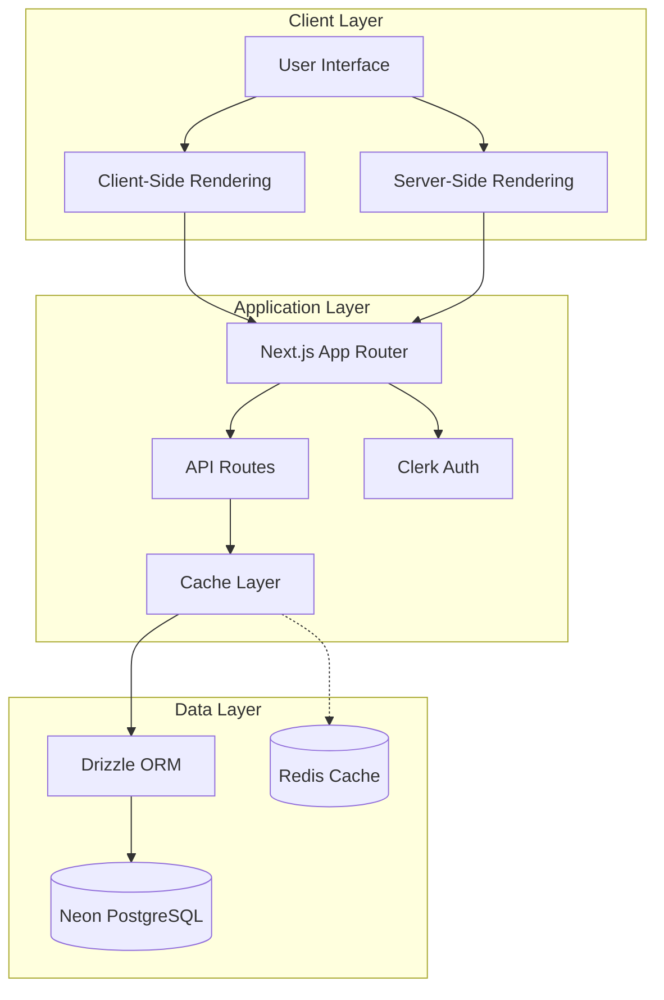
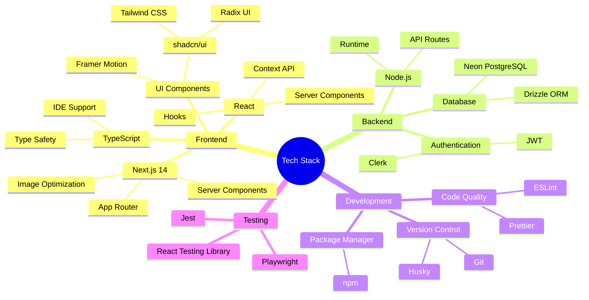
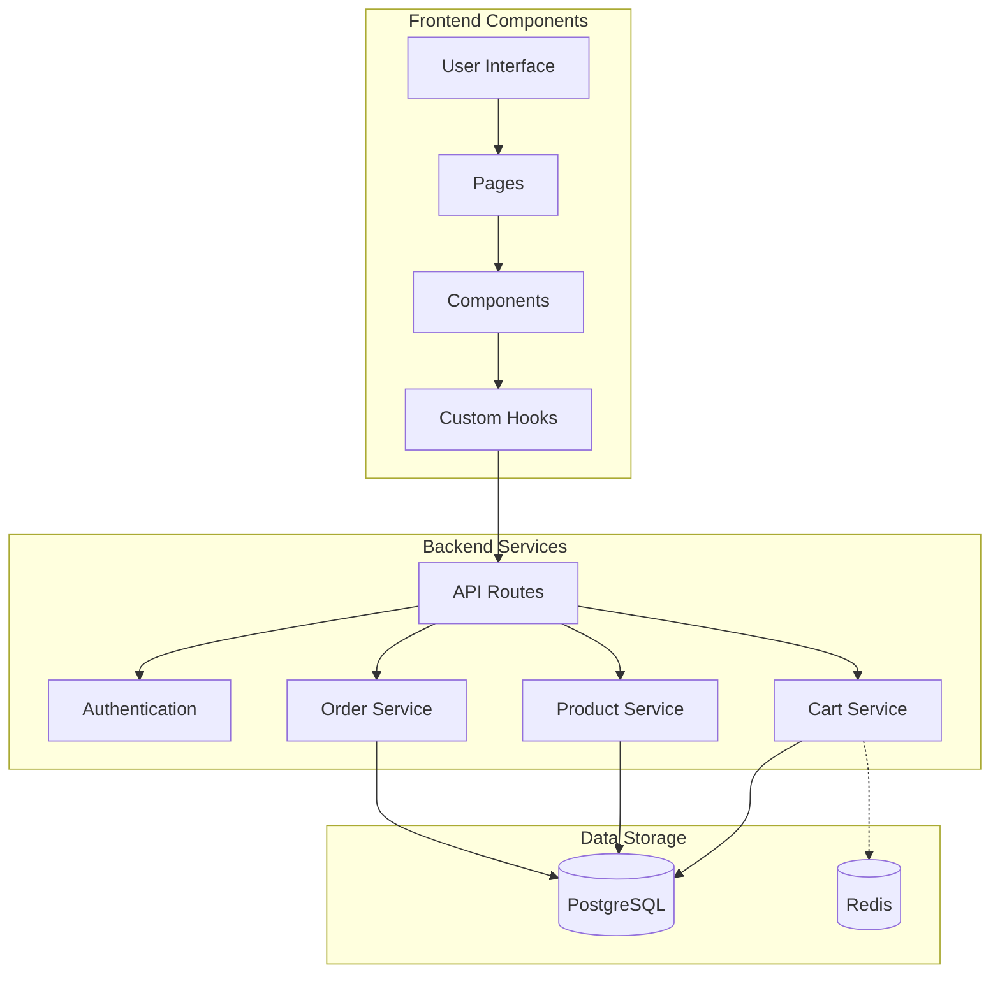
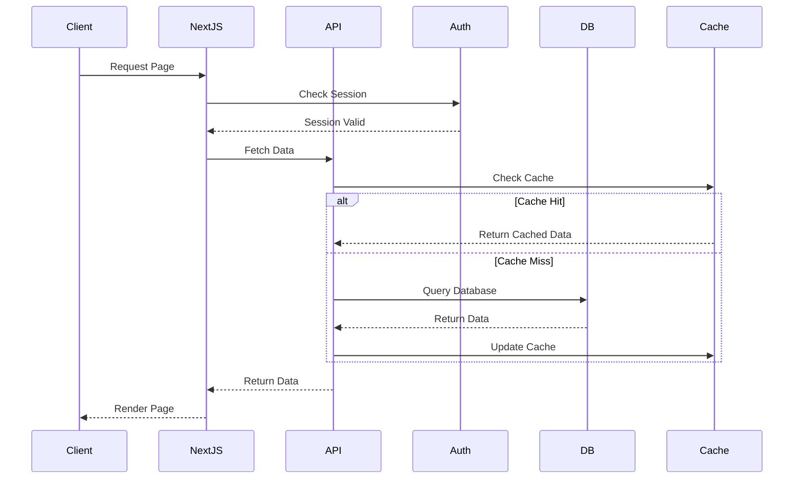
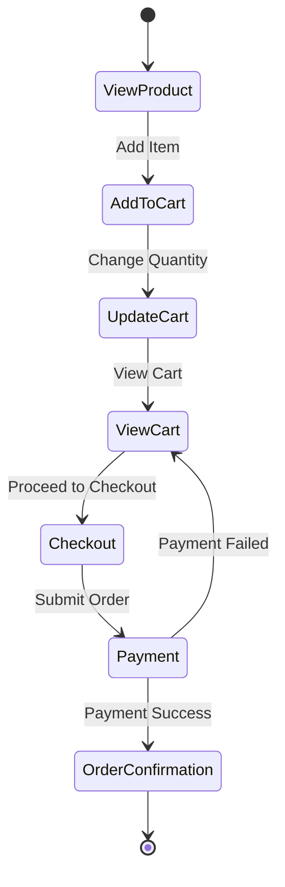
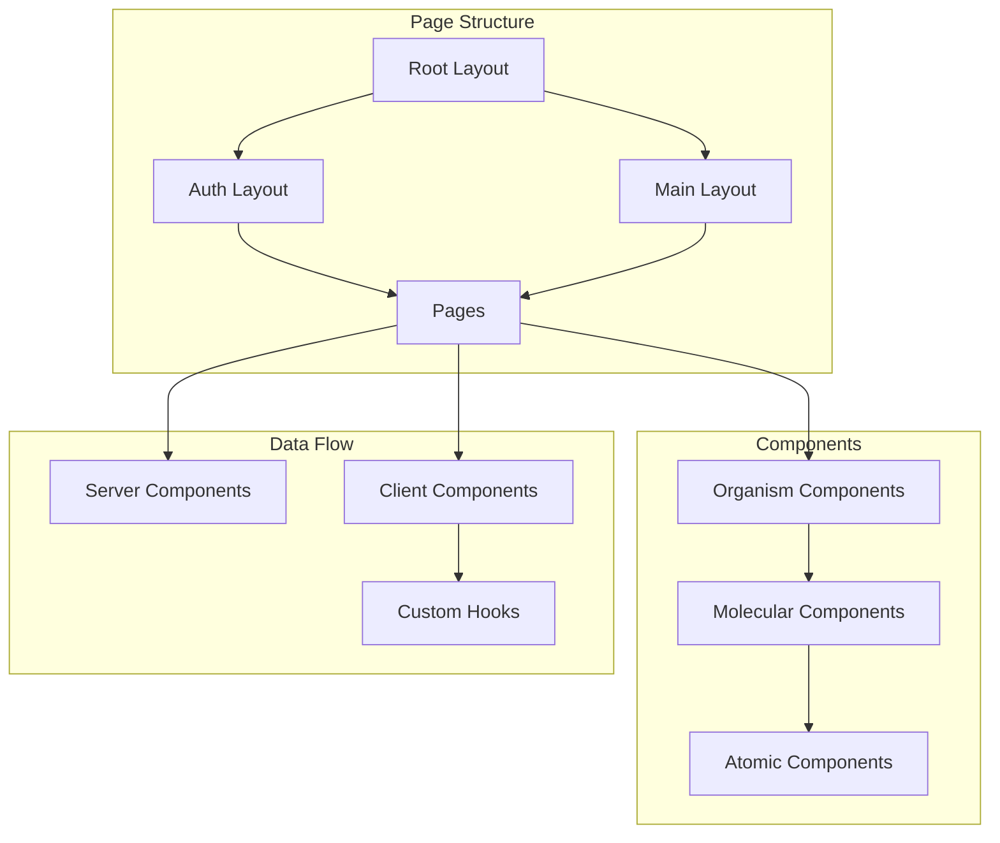
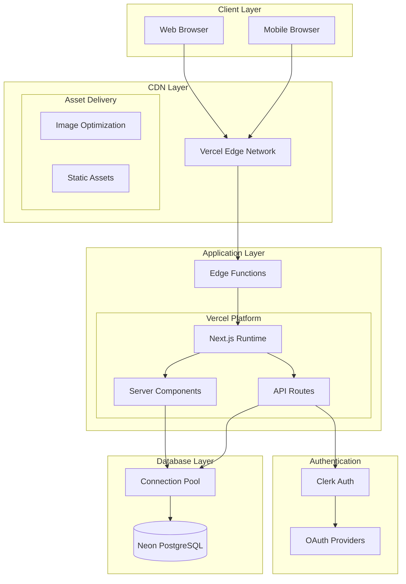
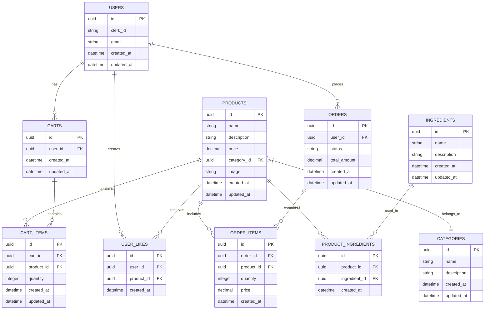

# Technical Implementation Report - Ice Cream Land E-commerce Platform

## Executive Summary

Ice Cream Land represents a modern e-commerce solution developed using cutting-edge web technologies. This technical report provides an in-depth analysis of the implementation decisions, frameworks, algorithms, and architectural patterns employed in the project.

### System Architecture Overview



## Core Technologies Overview



### Core Framework Technologies

| Technology   | Version | Purpose              | Key Features                        |
| ------------ | ------- | -------------------- | ----------------------------------- |
| Next.js      | 14.2.16 | Full-stack Framework | App Router, RSC, API Routes         |
| React        | 18.2.0  | UI Library           | Hooks, Server Components            |
| TypeScript   | 5.0.4   | Type System          | Static Typing, Type Safety          |
| shadcn/ui    | Latest  | UI Component System  | Accessible, Customizable Components |
| Tailwind CSS | 3.3.0   | Styling              | Utility Classes, JIT Compiler       |
| Drizzle ORM  | 0.36.4  | Database ORM         | Type Safety, Migrations             |
| Clerk        | 6.5.0   | Authentication       | User Management, OAuth              |

### Frontend Technologies

1. **Next.js 14**

   - **Purpose**: Full-stack React framework
   - **Key Features**:
     - App Router for file-based routing
     - React Server Components
     - Automatic code splitting
     - Image and font optimization
     - API routes
   - **Benefits**:
     - Improved performance
     - Better SEO
     - Developer productivity

2. **UI Component System**

   - **shadcn/ui**
     - Built on Radix UI primitives
     - Tailwind CSS styling
     - Fully customizable components
     - Copy-paste implementation
     - Consistent design system
     - Dark mode support
     - Accessibility built-in
   - **Radix UI** (v1.2+)
     - Accessible component primitives
     - Headless UI components
     - Customizable styling
   - **Framer Motion** (v11.12.0)
     - Animation library
     - Gesture handling
     - Transitions
   - **React Query** (v5.59.20)
     - Data fetching
     - Cache management
     - Server state sync

3. **Styling Solutions**
   - **Tailwind CSS**
     - Utility-first CSS
     - JIT compilation
     - Custom design system
     - Integration with shadcn/ui
   - **CVA** (class-variance-authority)
     - Component variants
     - Type-safe styles
   - **CLSX**
     - Conditional classes
     - Style composition

### Backend Technologies

1. **Database**

   - **Neon PostgreSQL**
     - Serverless PostgreSQL
     - Automatic scaling
     - Built-in connection pooling
   - **Drizzle ORM**
     - Type-safe queries
     - Schema migrations
     - Relationship management

2. **Authentication**

   - **Clerk**
     - User management
     - OAuth providers
     - Session handling
     - Security features

3. **API Layer**
   - **Next.js API Routes**
     - RESTful endpoints
     - Server-side validation
     - Error handling
   - **Zod**
     - Schema validation
     - Type inference
     - Runtime checks

### Development Tools

1. **Code Quality**

   - **ESLint**: Static code analysis
   - **Prettier**: Code formatting
   - **TypeScript**: Type checking
   - **Husky**: Git hooks

2. **Version Control**

   - **Git**: Source control
   - **Conventional Commits**: Commit standards
   - **GitHub Actions**: CI/CD

3. **Development Experience**
   - **npm**: Package management
   - **VS Code**: IDE
   - **Chrome DevTools**: Debugging

### Testing Framework

1. **Unit Testing**

   - **Jest**: Test runner
   - **React Testing Library**: Component testing
   - **MSW**: API mocking

2. **E2E Testing**
   - **Playwright**: Browser automation
   - **Cypress**: Integration testing

### Performance Optimization Tools

1. **Build Optimization**

   - Next.js built-in optimizer
   - Webpack bundle analyzer
   - Code splitting

2. **Runtime Optimization**
   - React Query caching
   - Image optimization
   - Font optimization

### Security Tools

1. **Authentication & Authorization**

   - Clerk security features
   - JWT validation
   - CSRF protection

2. **Data Protection**
   - Input sanitization
   - SQL injection prevention
   - XSS protection

Each technology was carefully selected based on:

- Performance requirements
- Developer experience
- Community support
- Integration capabilities
- Security features
- Scalability needs

The combination of these technologies creates a robust, scalable, and maintainable e-commerce platform that delivers excellent user experience while maintaining high development productivity.

## Project Overview

### Business Context

Ice Cream Land serves as an online platform for ice cream product sales, featuring:

- Product browsing and filtering
- Shopping cart functionality
- User authentication
- Order processing
- Product recommendations

### Technical Architecture



### Data Flow Architecture



### Shopping Cart Flow



## Framework Selection and Implementation

### Next.js 14 Component Architecture



## Project Overview

### Business Context

Ice Cream Land serves as an online platform for ice cream product sales, featuring:

- Product browsing and filtering
- Shopping cart functionality
- User authentication
- Order processing
- Product recommendations

### Technical Objectives

1. **Performance**

   - Fast page loads (target: < 2s First Contentful Paint)
   - Optimized image delivery
   - Efficient database queries

2. **Scalability**

   - Modular architecture
   - Stateless components
   - Efficient caching strategies

3. **User Experience**

   - Responsive design
   - Intuitive navigation
   - Real-time updates

4. **Security**
   - Secure authentication
   - Data encryption
   - Input validation

## Framework Selection and Implementation

### Next.js 14 Framework

Next.js 14 was selected as the primary framework after careful evaluation of several factors:

1. **Server Components Architecture**

   The App Router in Next.js 14 implements React Server Components (RSC), providing several critical advantages:

   a) **Performance Benefits**

   - Server-side rendering reduces client JavaScript bundle size
   - Streaming enables progressive page loading
   - Automatic code splitting optimizes resource delivery

   b) **Development Efficiency**

   - File-based routing simplifies navigation structure
   - Built-in API routes reduce backend complexity
   - Automatic optimization features

   c) **SEO Advantages**

   - Server-rendered content improves indexability
   - Metadata API enables dynamic SEO optimization
   - Structured data integration

   Implementation Example:

   ```typescript
   // app/layout.tsx
   import { Inter } from 'next/font/google';
   import { ClerkProvider } from '@clerk/nextjs';
   import { ThemeProvider } from '@/components/ThemeProvider';

   const inter = Inter({ subsets: ['latin'] });

   export const metadata = {
     title: {
       default: siteConfig.name,
       template: `%s | ${siteConfig.name}`,
     },
     description: siteConfig.description,
     keywords: ['ice cream', 'dessert', 'delivery', 'food', 'sweets'],
   };

   export default function RootLayout({
     children,
   }: {
     children: React.ReactNode;
   }) {
     return (
       <html lang="en">
         <body className={inter.className}>
           <ClerkProvider>
             <ThemeProvider>
               {children}
             </ThemeProvider>
           </ClerkProvider>
         </body>
       </html>
     );
   }
   ```

2. **File-based Routing System**

   The routing system is organized to optimize both user experience and code maintenance:

   ```
   app/
   ├── (auth)/
   │   ├── sign-in/
   │   └── sign-up/
   ├── (main)/
   │   ├── products/
   │   │   ├── [id]/
   │   │   └── page.tsx
   │   ├── cart/
   │   └── orders/
   ├── api/
   │   ├── products/
   │   ├── cart/
   │   └── orders/
   └── layout.tsx
   ```

   Each route implements specific optimizations:

   - Dynamic imports for code splitting
   - Parallel route loading
   - Optimized data fetching

### TypeScript Integration

TypeScript serves as the foundation for maintaining code quality and developer productivity:

1. **Type System Implementation**

   a) **Strict Configuration**

   ```json
   {
     "compilerOptions": {
       "target": "es5",
       "lib": ["dom", "dom.iterable", "esnext"],
       "allowJs": true,
       "skipLibCheck": true,
       "strict": true,
       "forceConsistentCasingInFileNames": true,
       "noEmit": true,
       "esModuleInterop": true,
       "module": "esnext",
       "moduleResolution": "node",
       "resolveJsonModule": true,
       "isolatedModules": true,
       "jsx": "preserve",
       "incremental": true,
       "plugins": [
         {
           "name": "next"
         }
       ]
     }
   }
   ```

   b) **Type Safety Benefits**

   - Compile-time error detection
   - Improved code documentation
   - Enhanced IDE support
   - Refactoring confidence

2. **Interface-Driven Development**

   All major data structures are defined through interfaces, ensuring consistency across the application:

   ```typescript
   // types/product.ts
   interface Product {
     id: string;
     name: string;
     description: string;
     price: number;
     categoryId: string;
     image: string;
     createdAt: Date;
     updatedAt: Date;
   }

   interface ProductWithRelations extends Product {
     category: Category;
     ingredients: Ingredient[];
     likes?: UserLike[];
   }

   // types/cart.ts
   interface CartItem {
     id: string;
     productId: string;
     quantity: number;
     product: Product;
   }

   interface Cart {
     id: string;
     userId: string;
     items: CartItem[];
     createdAt: Date;
     updatedAt: Date;
   }
   ```

## Database Architecture and Algorithms

### Neon PostgreSQL Implementation

The database architecture is designed for optimal performance and scalability:

1. **Connection Management**

   a) **Pooling Strategy**

   ```typescript
   import { neon } from '@neondatabase/serverless';
   import { drizzle } from 'drizzle-orm/neon-http';

   const sql = neon(process.env.DATABASE_URL!);
   export const db = drizzle(sql);
   ```

   b) **Performance Optimizations**

   - Connection pooling
   - Prepared statements
   - Query caching

2. **Query Optimization**

   Implemented various strategies for optimal query performance:

   ```typescript
   // Efficient query with relations
   async function getProductWithRelations(id: string) {
     return await db.query.products.findFirst({
       where: eq(products.id, id),
       with: {
         category: true,
         ingredients: {
           with: {
             ingredient: true,
           },
         },
       },
     });
   }

   // Optimized bulk operations
   async function updateProductPrices(updates: { id: string; price: number }[]) {
     return await db.transaction(async (tx) => {
       const promises = updates.map(({ id, price }) =>
         tx.update(products).set({ price, updatedAt: new Date() }).where(eq(products.id, id))
       );
       await Promise.all(promises);
     });
   }
   ```

## Authentication Implementation

### Clerk Authentication System

1. **Integration Architecture**

   Clerk is integrated at multiple levels:

   - Middleware for route protection
   - API route authentication
   - Component-level user state

2. **Session Management Algorithm**

   ```typescript
   import { authMiddleware } from '@clerk/nextjs';

   export default authMiddleware({
     publicRoutes: ['/', '/products(.*)'],
     ignoredRoutes: ['/api/public(.*)'],
   });
   ```

## Frontend Implementation Algorithms

### Component Architecture

1. **Atomic Design Pattern**

   Components are organized following the atomic design methodology:

   a) **Atoms (Basic Components)**

   ```typescript
   // Button component with variants
   export function Button({
     variant = 'primary',
     size = 'medium',
     ...props
   }: ButtonProps) {
     const styles = {
       primary: 'bg-primary text-white',
       secondary: 'bg-secondary text-primary',
       sizes: {
         small: 'px-3 py-1.5',
         medium: 'px-4 py-2',
         large: 'px-6 py-3',
       },
     };

     return (
       <button
         className={cn(
           'rounded-md font-medium transition-colors',
           styles[variant],
           styles.sizes[size]
         )}
         {...props}
       />
     );
   }
   ```

   b) **Molecules (Component Combinations)**

   ```typescript
   // Product card combining multiple atoms
   export function ProductCard({ product }: ProductCardProps) {
     return (
       <div className="group relative">
         <ProductImage product={product} />
         <div className="mt-4 flex justify-between">
           <div>
             <h3 className="text-sm font-medium">{product.name}</h3>
             <p className="text-sm text-gray-500">{product.category.name}</p>
           </div>
           <Price amount={product.price} />
         </div>
         <AddToCartButton productId={product.id} />
       </div>
     );
   }
   ```

2. **State Management Patterns**

   a) **Server State Management**

   Using React Query for data fetching and caching:

   ```typescript
   export function useProducts() {
     return useQuery({
       queryKey: ['products'],
       queryFn: async () => {
         const response = await fetch('/api/products');
         if (!response.ok) throw new Error('Failed to fetch products');
         return response.json();
       },
       staleTime: 1000 * 60 * 5, // 5 minutes
     });
   }
   ```

   b) **Client State Management**

   Using React's useState and useReducer for local state:

   ```typescript
   export function useCart() {
     const [cart, dispatch] = useReducer(cartReducer, initialCart);

     const addItem = useCallback((product: Product, quantity: number) => {
       dispatch({ type: 'ADD_ITEM', payload: { product, quantity } });
     }, []);

     const updateQuantity = useCallback((itemId: string, quantity: number) => {
       dispatch({ type: 'UPDATE_QUANTITY', payload: { itemId, quantity } });
     }, []);

     return { cart, addItem, updateQuantity };
   }
   ```

## Shopping Cart Algorithm

1. **Cart State Management**

   The cart implementation uses a combination of local state and server synchronization:

   ```typescript
   interface CartState {
     items: CartItem[];
     total: number;
     itemCount: number;
   }

   type CartAction =
     | { type: 'ADD_ITEM'; payload: { product: Product; quantity: number } }
     | { type: 'UPDATE_QUANTITY'; payload: { itemId: string; quantity: number } }
     | { type: 'REMOVE_ITEM'; payload: { itemId: string } }
     | { type: 'CLEAR_CART' };

   function cartReducer(state: CartState, action: CartAction): CartState {
     switch (action.type) {
       case 'ADD_ITEM': {
         const { product, quantity } = action.payload;
         const existingItem = state.items.find((item) => item.productId === product.id);

         if (existingItem) {
           return {
             ...state,
             items: state.items.map((item) =>
               item.id === existingItem.id ? { ...item, quantity: item.quantity + quantity } : item
             ),
           };
         }

         return {
           ...state,
           items: [
             ...state.items,
             {
               id: crypto.randomUUID(),
               productId: product.id,
               quantity,
               product,
             },
           ],
         };
       }
       // Other cases...
     }
   }
   ```

2. **Price Calculation Algorithm**

   ```typescript
   function calculateCartTotal(items: CartItem[]): number {
     return items.reduce((total, item) => {
       const itemPrice = item.product.price * item.quantity;
       return total + itemPrice;
     }, 0);
   }

   function calculateTax(subtotal: number, taxRate: number): number {
     return subtotal * (taxRate / 100);
   }

   function calculateFinalPrice(subtotal: number, taxRate: number, discounts: Discount[]): number {
     const tax = calculateTax(subtotal, taxRate);
     const discountAmount = discounts.reduce((total, discount) => total + discount.amount, 0);
     return subtotal + tax - discountAmount;
   }
   ```

## Performance Optimization Algorithms

1. **Image Loading Strategy**

   ```typescript
   export function ProductImage({
     product,
     priority = false
   }: ProductImageProps) {
     return (
       <div className="relative aspect-square">
         <Image
           src={product.image}
           alt={product.name}
           fill
           className="object-cover"
           sizes="(min-width: 1024px) 20vw, (min-width: 768px) 25vw, 50vw"
           priority={priority}
           loading={priority ? 'eager' : 'lazy'}
         />
       </div>
     );
   }
   ```

2. **Data Fetching Optimization**

   ```typescript
   async function getProduct(id: string) {
     const cached = await redis.get(`product:${id}`);
     if (cached) return JSON.parse(cached);

     const product = await db.query.products.findFirst({
       where: eq(products.id, id),
       with: {
         category: true,
         ingredients: true,
       },
     });

     if (product) {
       await redis.set(`product:${id}`, JSON.stringify(product), 'EX', 3600);
     }

     return product;
   }
   ```

## Security Implementation

1. **Input Validation Algorithm**

   ```typescript
   import { z } from 'zod';

   const productSchema = z.object({
     name: z.string().min(1).max(100),
     description: z.string().min(1).max(1000),
     price: z.number().positive(),
     categoryId: z.string().uuid(),
     image: z.string().url(),
   });

   export async function validateProduct(input: unknown) {
     try {
       return {
         success: true,
         data: productSchema.parse(input),
       };
     } catch (error) {
       return {
         success: false,
         error: error instanceof z.ZodError ? error.errors : 'Invalid input',
       };
     }
   }
   ```

2. **Authentication Flow**

   ```typescript
   async function protectedRoute(req: Request, params: { id: string }) {
     const { userId } = await auth();
     if (!userId) {
       return new Response('Unauthorized', { status: 401 });
     }

     const user = await db.query.users.findFirst({
       where: eq(users.userId, userId),
     });

     if (!user) {
       return new Response('User not found', { status: 404 });
     }

     // Protected route logic
   }
   ```

## Deployment Architecture

### Infrastructure Overview



### Deployment Components

1. **Vercel Platform**

   - **Edge Network**
     - Global CDN distribution
     - Automatic SSL/TLS
     - DDoS protection
     - Edge caching
   - **Build Process**
     ```mermaid
     sequenceDiagram
         participant Git
         participant Vercel
         participant Build
         participant Deploy

         Git->>Vercel: Push to main
         Vercel->>Build: Trigger build
         Build->>Build: Install dependencies
         Build->>Build: Run build process
         Build->>Build: Generate static assets
         Build->>Deploy: Deploy to edge
         Deploy->>Deploy: Run health checks
         Deploy->>Vercel: Deployment complete
     ```

2. **Database Deployment**

   - **Neon PostgreSQL**
     - Serverless scaling
     - Automatic backups
     - Point-in-time recovery
     - Read replicas

   ```mermaid
   flowchart TB
       subgraph "Database Architecture"
           Write[(Primary DB)]
           Read[(Read Replica)]
           Backup[(Backup)]

           App[Application] --> Pool[Connection Pool]
           Pool --> Write
           Pool -.-> Read
           Write --> Backup
       end
   ```

3. **Environment Configuration**
   ```mermaid
   graph LR
       subgraph "Environment Management"
           Dev[Development]
           Stage[Staging]
           Prod[Production]

           Dev --> Stage
           Stage --> Prod

           Dev -.- DevEnv[.env.development]
           Stage -.- StageEnv[.env.staging]
           Prod -.- ProdEnv[.env.production]
       end
   ```

### Deployment Process

1. **Continuous Integration**

   ```yaml
   # Example GitHub Actions workflow
   name: CI/CD Pipeline

   on:
     push:
       branches: [main]
     pull_request:
       branches: [main]

   jobs:
     test:
       runs-on: ubuntu-latest
       steps:
         - uses: actions/checkout@v2
         - name: Setup Node.js
           uses: actions/setup-node@v2
         - name: Install dependencies
           run: npm ci
         - name: Run tests
           run: npm test

     deploy:
       needs: test
       runs-on: ubuntu-latest
       steps:
         - uses: actions/vercel-deploy@v2
   ```

2. **Deployment Environments**

   | Environment | Purpose           | Domain                     | Branch     |
   | ----------- | ----------------- | -------------------------- | ---------- |
   | Development | Local development | localhost:3000             | feature/\* |
   | Staging     | Testing           | staging.ice-cream-land.com | develop    |
   | Production  | Live site         | ice-cream-land.com         | main       |

3. **Security Measures**
   - SSL/TLS encryption
   - HTTP/2 support
   - Content Security Policy
   - CORS configuration
   - Rate limiting

### Performance Optimization

1. **Edge Functions**

   - API route optimization
   - Geolocation-based routing
   - Request/response caching

2. **CDN Configuration**

   ```mermaid
   graph LR
       subgraph "CDN Strategy"
           User[User] --> Edge[Edge Location]
           Edge --> Cache[Cache]
           Cache --> Origin[Origin Server]

           Cache -- Hit --> User
           Cache -- Miss --> Origin
       end
   ```

3. **Asset Optimization**
   - Image optimization
   - Font subsetting
   - JavaScript minification
   - CSS purging

### Monitoring and Analytics

1. **Performance Monitoring**

   - Vercel Analytics
   - Real User Monitoring (RUM)
   - Core Web Vitals tracking

2. **Error Tracking**

   - Error reporting
   - Exception handling
   - Performance bottlenecks

3. **Metrics Dashboard**
   ```mermaid
   graph TB
       subgraph "Monitoring Stack"
           Vercel[Vercel Analytics]
           Logs[Application Logs]
           Metrics[System Metrics]

           App[Application] --> Vercel
           App --> Logs
           App --> Metrics

           Vercel --> Dashboard[Dashboard]
           Logs --> Dashboard
           Metrics --> Dashboard
       end
   ```

### Scaling Strategy

1. **Horizontal Scaling**

   - Automatic instance scaling
   - Load balancing
   - Database connection pooling

2. **Vertical Scaling**

   - Memory optimization
   - CPU utilization
   - Database resources

3. **Cache Strategy**
   ```mermaid
   flowchart TB
       subgraph "Caching Layers"
           Browser[Browser Cache]
           CDN[CDN Cache]
           Edge[Edge Cache]
           App[Application Cache]
           DB[Database Cache]

           Request[Request] --> Browser
           Browser --> CDN
           CDN --> Edge
           Edge --> App
           App --> DB
       end
   ```

### Disaster Recovery

1. **Backup Strategy**

   - Database backups
   - Configuration backups
   - Asset backups

2. **Recovery Process**

   - Rollback procedures
   - Data restoration
   - Service recovery

3. **High Availability**
   ```mermaid
   graph TB
       subgraph "HA Architecture"
           LB[Load Balancer]
           App1[Instance 1]
           App2[Instance 2]
           DB1[(Primary DB)]
           DB2[(Replica DB)]

           LB --> App1 & App2
           App1 & App2 --> DB1
           DB1 --> DB2
       end
   ```

## Database Entity Relationship Diagram



This Entity Relationship Diagram (ERD) illustrates the complete database structure of the Ice Cream Land platform. Here's a detailed explanation of each entity and its relationships:

1. **Users**

   - Core user entity storing Clerk authentication details
   - One-to-many relationships with carts, orders, and product likes
   - Tracks user creation and updates

2. **Products**

   - Central product entity with basic details
   - Belongs to one category
   - Has many ingredients through product_ingredients
   - Can be in multiple carts and orders
   - Can be liked by multiple users

3. **Categories**

   - Product categorization
   - One-to-many relationship with products
   - Contains metadata about the category

4. **Ingredients**

   - Product ingredients information
   - Many-to-many relationship with products through product_ingredients
   - Enables detailed product composition tracking

5. **Carts and Cart Items**

   - Shopping cart implementation
   - Cart belongs to one user
   - Cart items track product quantities
   - Enables persistent shopping cart functionality

6. **Orders and Order Items**

   - Order processing system
   - Orders belong to one user
   - Order items maintain price history
   - Tracks order status and totals

7. **User Likes**
   - Product favoriting system
   - Many-to-many relationship between users and products
   - Enables product recommendation features

Key Features of the Schema:

- UUID usage for all primary keys
- Consistent timestamp tracking
- Proper foreign key relationships
- Scalable structure for e-commerce operations

## Conclusion

The technical implementation of Ice Cream Land demonstrates a careful balance between modern frameworks, optimized algorithms, and security considerations. The use of Next.js 14 with TypeScript provides a robust foundation, while carefully implemented algorithms for cart management, data fetching, and security ensure a reliable and performant application.

Key technical achievements include:

- Type-safe database operations with Drizzle ORM
- Optimized image loading and caching strategies
- Secure authentication flow with Clerk
- Efficient cart state management
- Robust input validation and error handling

The combination of these technologies and algorithms results in a scalable, maintainable, and secure e-commerce platform.
