# Ice Cream Land - Use Case Documentation

## System Actors

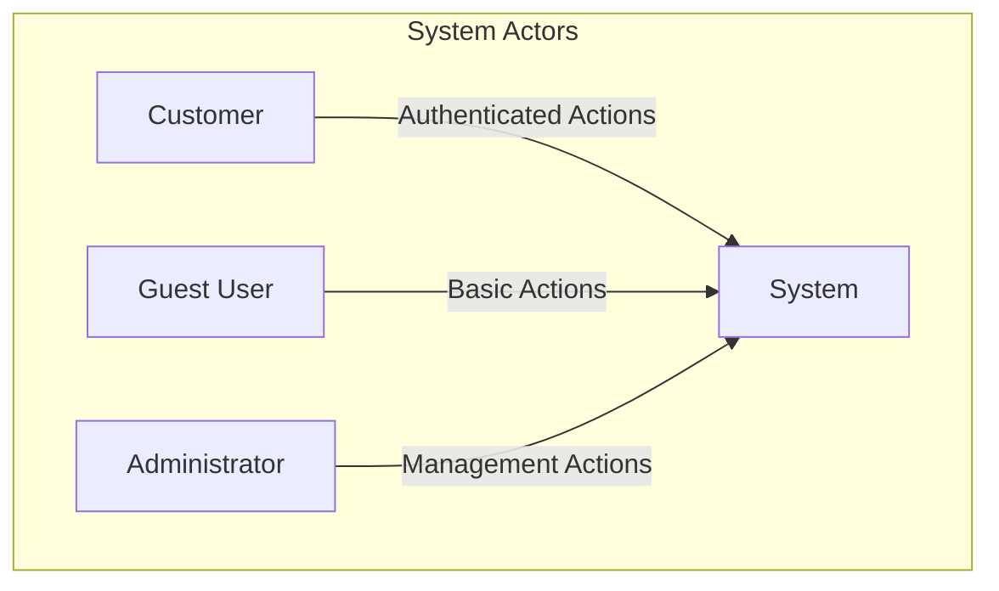

## Core Use Cases Overview

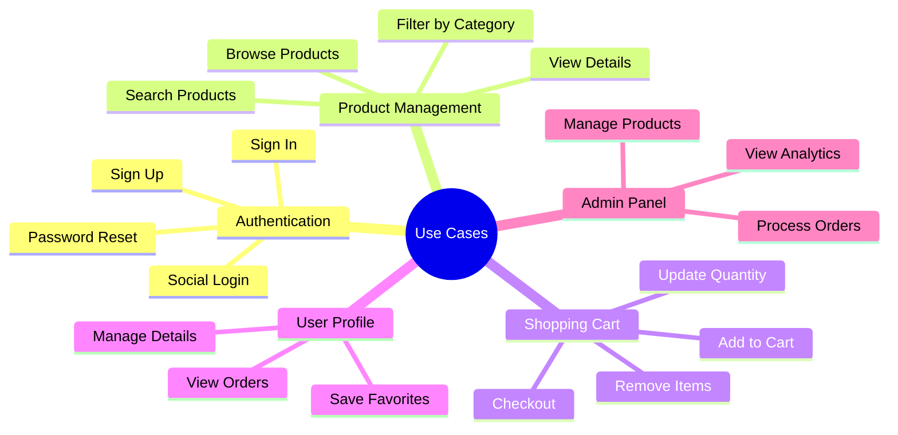

## Detailed Use Case Scenarios

### 1. Customer Authentication Flow

#### 1.1 Sign Up Process

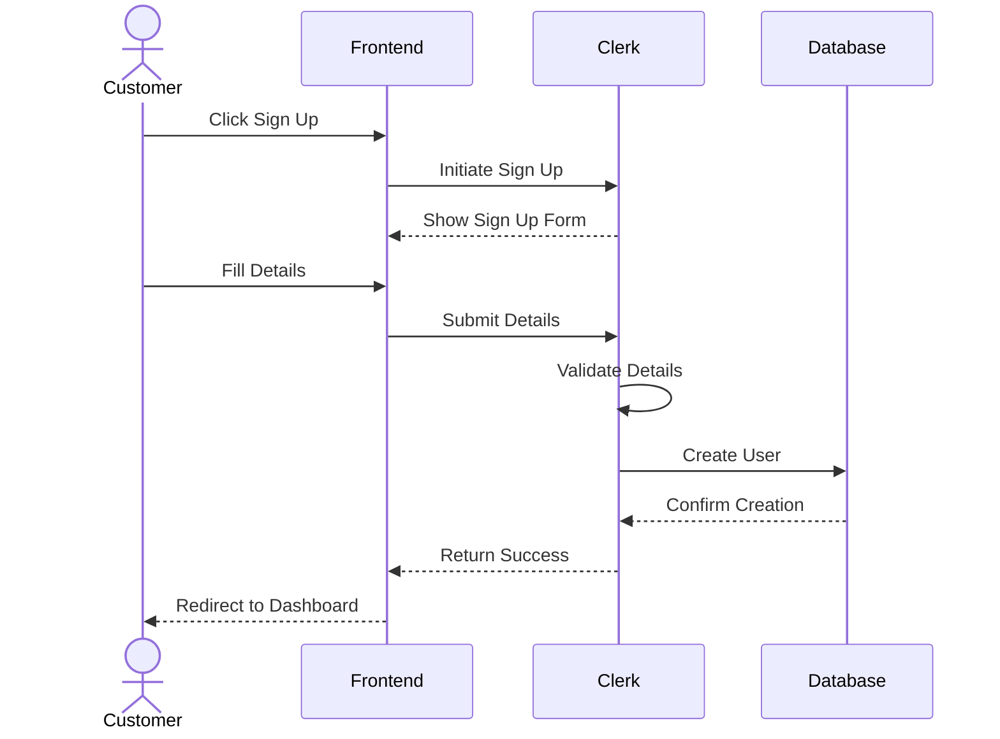

**Scenario Description:**

1. Customer clicks "Sign Up" button
2. System displays registration form
3. Customer enters:
   - Email address
   - Password
   - Name
   - Optional phone number
4. System validates input
5. System creates account
6. System sends verification email
7. Customer verifies email
8. System activates account

#### 1.2 Sign In Process

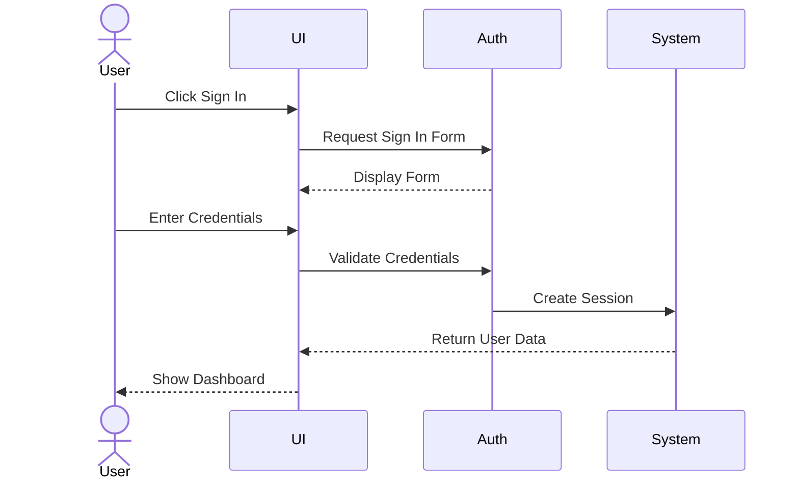

### 2. Product Browsing and Search

#### 2.1 Browse Products

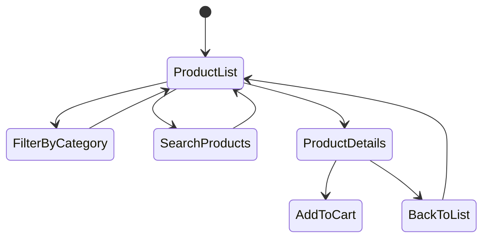

**Scenario Description:**

1. User lands on product listing page
2. Available actions:
   - View all products
   - Filter by category
   - Sort by price/popularity
   - Search by name
3. User can:
   - Click product for details
   - Add to cart directly
   - Save to favorites

#### 2.2 Search and Filter

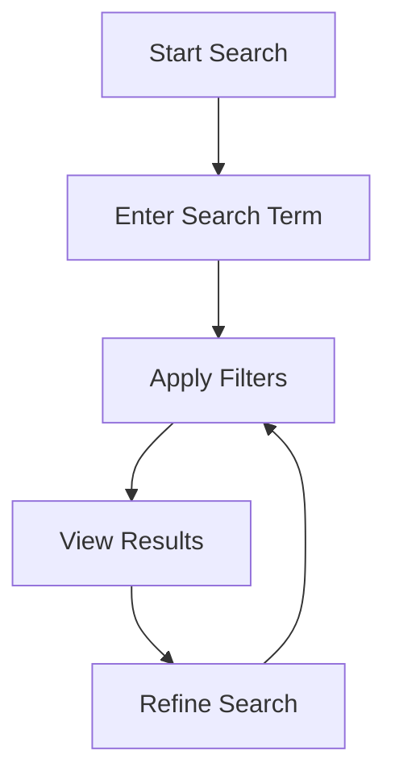

### 3. Shopping Cart Management

#### 3.1 Cart Operations

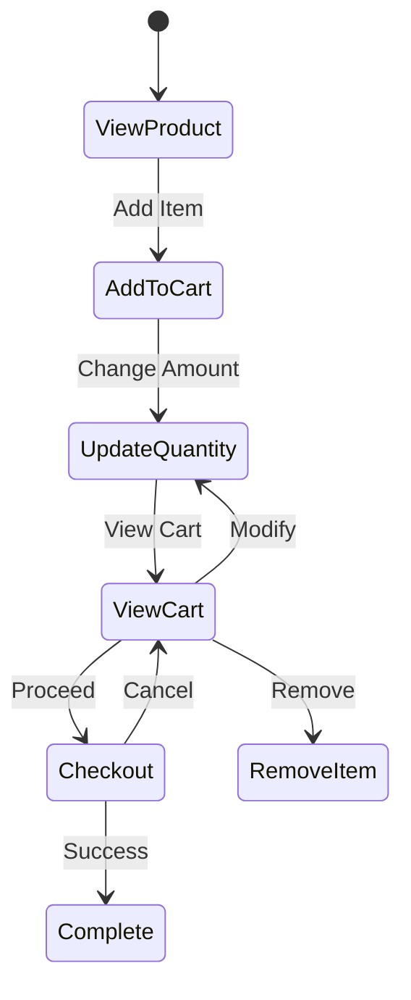

**Scenario Description:**

1. Add to Cart:

   - Select product
   - Choose quantity
   - Click "Add to Cart"
   - View confirmation

2. Update Cart:

   - Modify quantities
   - Remove items
   - View total price
   - Apply discounts

3. Checkout Process:
   - Review items
   - Enter shipping details
   - Choose payment method
   - Confirm order

### 4. User Profile Management

#### 4.1 Profile Operations

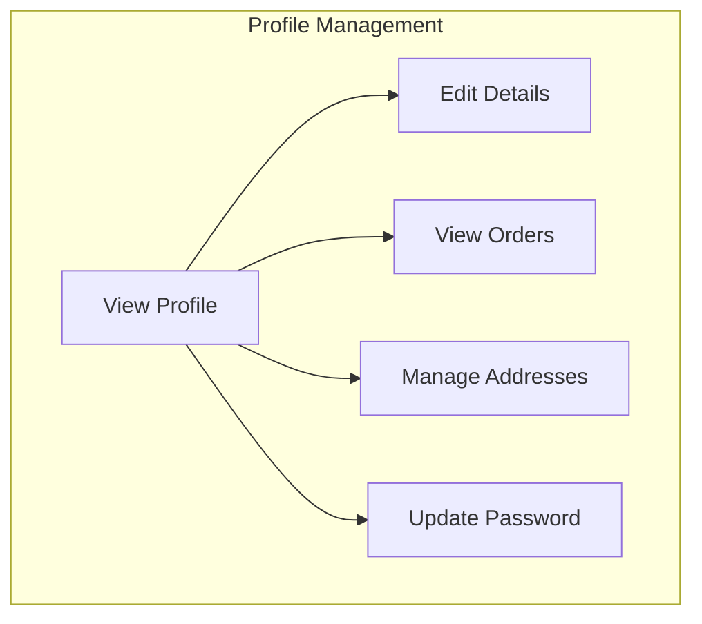

**Scenario Description:**

1. View Profile:

   - Personal details
   - Order history
   - Saved addresses
   - Payment methods

2. Edit Profile:
   - Update contact info
   - Change password
   - Manage preferences
   - Set notifications

### 5. Order Processing

#### 5.1 Order Flow

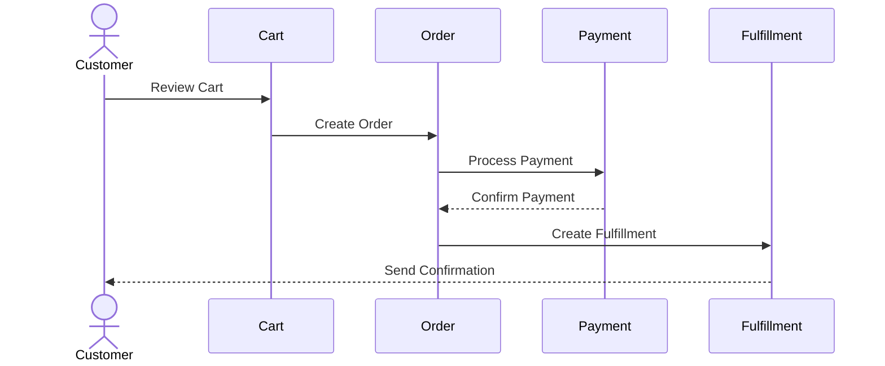

**Scenario Description:**

1. Place Order:

   - Review cart
   - Enter shipping info
   - Choose payment method
   - Confirm order

2. Order Processing:
   - Payment verification
   - Order confirmation
   - Shipping updates
   - Delivery confirmation

### 6. Administrator Functions

#### 6.1 Product Management

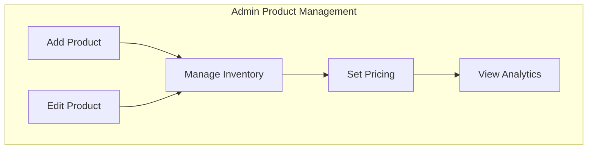

**Scenario Description:**

1. Product Management:

   - Add new products
   - Update existing products
   - Manage inventory
   - Set pricing
   - View analytics

2. Order Management:
   - View orders
   - Update status
   - Process refunds
   - Generate reports

### 7. System Interactions

#### 7.1 Notification System

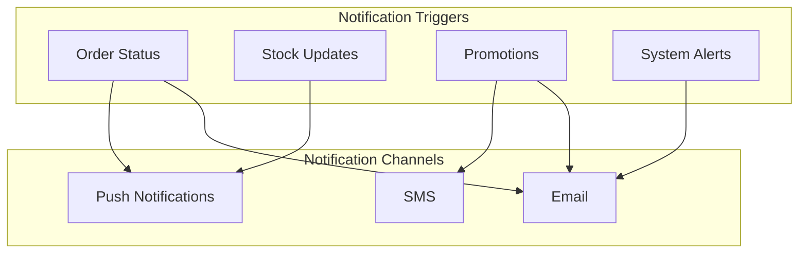

**Scenario Description:**

1. Order Notifications:

   - Order confirmation
   - Shipping updates
   - Delivery confirmation
   - Review requests

2. System Notifications:
   - Stock alerts
   - Price changes
   - Promotions
   - Security alerts

## Use Case Success Criteria

### Customer Success Metrics

- Successful order completion rate
- Cart abandonment rate
- Search success rate
- Payment success rate

### System Performance Metrics

- Page load times
- Search response time
- Checkout completion time
- Error rates

### Business Success Metrics

- Conversion rate
- Average order value
- Customer retention rate
- User engagement metrics

## Error Scenarios and Recovery

### Common Error Scenarios

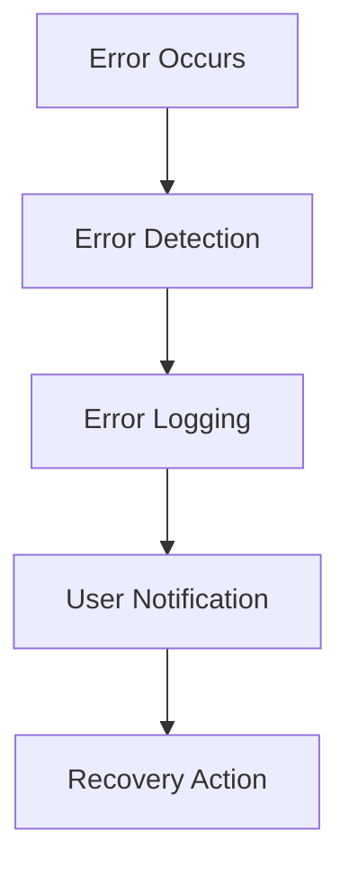

1. Payment Failures

   - Invalid card
   - Insufficient funds
   - Network issues
   - Recovery: Retry or alternative payment

2. Stock Issues

   - Out of stock
   - Insufficient quantity
   - Recovery: Waitlist or alternatives

3. Session Errors
   - Timeout
   - Invalid session
   - Recovery: Re-authentication

## Integration Points

### External System Integration

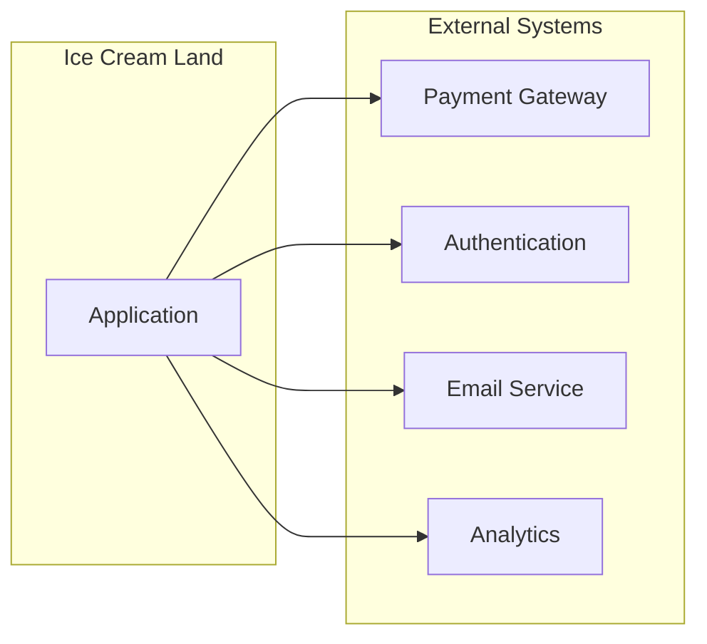

1. Payment Processing

   - Payment gateway integration
   - Transaction handling
   - Refund processing

2. Authentication

   - Social login providers
   - Two-factor authentication
   - Password recovery

3. Communication
   - Email notifications
   - SMS alerts
   - Push notifications

## Security Considerations

### Security Measures

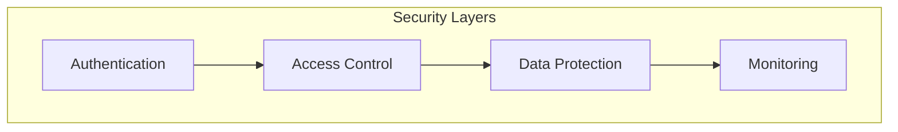

1. Authentication Security

   - Multi-factor authentication
   - Session management
   - Password policies

2. Data Protection

   - Encryption at rest
   - Secure transmission
   - Data backup

3. Access Control
   - Role-based access
   - Permission management
   - Activity logging

## Conclusion

This documentation covers all major use cases of the Ice Cream Land e-commerce platform, providing detailed scenarios, flow diagrams, and implementation considerations for each feature. The use cases are designed to ensure a seamless user experience while maintaining system security and performance.
